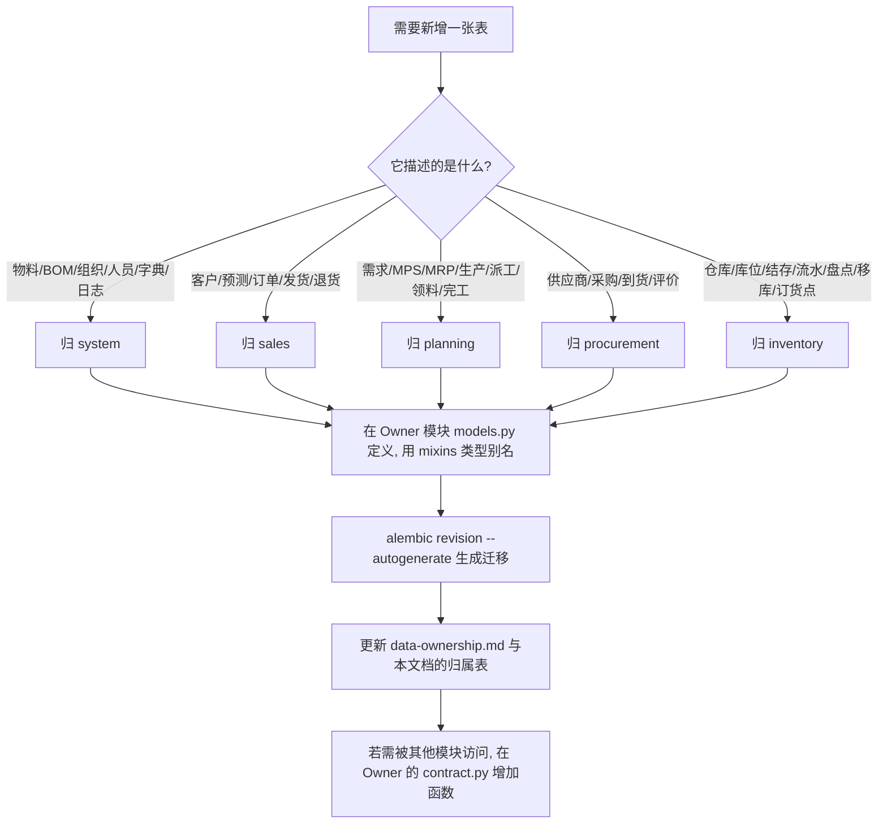

# 模块数据归属与调用矩阵（Module Ownership）

> 本文回答三个问题：**每张表归谁？谁能读？谁能写？**
> 依据是真实代码：`backend/app/modules/*/models.py`（表定义）、
> `*_contract.py`（对外能力）、`*_service.py`（实际调用点）。
>
> 相关文档：[`system-architecture.md`](./system-architecture.md)（整体架构）、
> [`data-ownership.md`](./data-ownership.md)（归属规划原文）、
> [`../database/full-er-diagram.md`](../database/full-er-diagram.md)（表间关系）。

## 一、三条铁律

1. **一张表只有一个 Owner 模块**，表名前缀即 Owner（`sys_`→system、`sal_`→sales、
   `pln_`→planning、`pur_`→procurement、`inv_`→inventory）。
2. **只有 Owner 能写自己的表。** 其他模块要写，只能调用 Owner 在
   `contract.py` 中**显式提供的写入函数**（写入代码仍位于 Owner 模块内）。
3. **只能通过 `contract.py` 读别人的数据**，禁止 import 其他模块的
   `models` / `repository` / `service` / `schemas`。

判断一个改动是否违规，只需看两点：
（a）SQL 里出现的表名是否都属于本模块？（b）跨模块调用是否只碰了 `contract.py` 的函数？

## 二、逐表归属矩阵（52 张表）

「读/写途径」列给出**唯一合法**的方式；「—」表示当前没有任何跨模块访问。

### 2.1 system 模块（15 张，Owner = system）

| 表名 | Owner | 其他模块可读 | 读途径 | 其他模块可写 | 写途径 |
| --- | --- | --- | --- | --- | --- |
| `sys_material` | system | **是**：sales / planning / procurement / inventory | `system.contract.get_material`、`get_materials`、`find_material_by_code`、`search_materials`、`get_finished_materials` | 否 | — |
| `sys_bom` | system | **是**：planning | `system.contract.get_active_bom`、`get_bom`（`has_bom` 已暴露，暂无调用方） | 否 | — |
| `sys_bom_item` | system | **是**：planning | `system.contract.get_active_bom_children` | 否 | — |
| `sys_personnel` | system | **是**：planning / procurement / sales | `system.contract.get_personnel`、`get_personnel_name`、`get_personnel_names` | 否 | — |
| `sys_operation_log` | system | 否（仅追加） | — | **仅追加**：所有模块 | `system.contract.log_operation`（无 UPDATE/DELETE 入口） |
| `sys_organization` | system | 否 | — | 否 | — |
| `sys_user` | system | 否 | — | 否 | — |
| `sys_role` | system | 否 | — | 否 | — |
| `sys_permission` | system | 否 | — | 否 | — |
| `sys_user_role` | system | 否 | — | 否 | — |
| `sys_role_permission` | system | 否 | — | 否 | — |
| `sys_dictionary` | system | 否 | — | 否 | — |
| `sys_dictionary_item` | system | 否 | — | 否 | — |
| `sys_routing` | system | 否 | — | 否 | — |
| `sys_routing_operation` | system | 否 | — | 否 | — |

> `sys_material` 是全系统唯一的物料主表；`sys_bom` / `sys_bom_item` 只服务于 planning 的
> MRP 展开与 system 自身的 BOM 维护界面。

### 2.2 sales 模块（8 张，Owner = sales）

| 表名 | Owner | 其他模块可读 | 读途径 | 其他模块可写 | 写途径 |
| --- | --- | --- | --- | --- | --- |
| `sal_order` | sales | **是**：planning | `sales.contract.get_open_order_demand` | 否 | — |
| `sal_order_item` | sales | **是**：planning | 同上（按未交付数量聚合）；`get_open_order_qty` 已暴露，暂无调用方 | 否 | — |
| `sal_customer` | sales | 否 | （`get_customer_name` 已暴露，暂无调用方） | 否 | — |
| `sal_forecast` | sales | 否 | （`get_confirmed_forecast_demand` 已暴露，暂无调用方） | 否 | — |
| `sal_shipment` | sales | 否 | — | 否 | — |
| `sal_shipment_item` | sales | 否 | — | 否 | — |
| `sal_return` | sales | 否 | — | 否 | — |
| `sal_return_item` | sales | 否 | — | 否 | — |

> sales 是**叶子消费方**：它读 system（物料/人员）与 inventory（库存），
> 但自己的数据只被 planning 的计划归集读取。

### 2.3 planning 模块（10 张，Owner = planning）

| 表名 | Owner | 其他模块可读 | 读途径 | 其他模块可写 | 写途径 |
| --- | --- | --- | --- | --- | --- |
| `pln_mrp_result` | planning | **是**：procurement | `planning.contract.get_mrp_results` | 否 | — |
| `pln_production_plan` | planning | 否 | （`get_open_production_qty` 已暴露，暂无调用方） | **可间接写**：inventory | `planning.contract.create_production_plan_from_replenishment`（写入代码在 planning 内，幂等） |
| `pln_demand` | planning | 否 | — | 否 | — |
| `pln_mps` | planning | 否 | — | 否 | — |
| `pln_mps_item` | planning | 否 | — | 否 | — |
| `pln_mrp_run` | planning | 否 | — | 否 | — |
| `pln_dispatch_order` | planning | 否 | — | 否 | — |
| `pln_material_requisition` | planning | 否 | — | 否 | — |
| `pln_material_requisition_item` | planning | 否 | — | 否 | — |
| `pln_completion_report` | planning | 否 | — | 否 | — |

> planning 同时拥有**计划**（需求/MPS/MRP）与**生产执行**（生产作业计划/派工/领料/完工）。
> 领料与完工只通过 `inventory.contract` 改库存，绝不直接写 `inv_*`。

### 2.4 procurement 模块（9 张，Owner = procurement）

| 表名 | Owner | 其他模块可读 | 读途径 | 其他模块可写 | 写途径 |
| --- | --- | --- | --- | --- | --- |
| `pur_purchase_plan` | procurement | 否 | — | **可间接写**：planning、inventory | `procurement.contract.create_purchase_plan_from_mrp`、`create_purchase_plan_from_replenishment` |
| `pur_purchase_plan_item` | procurement | 否 | — | **可间接写**：planning、inventory | 同上 |
| `pur_order` / `pur_order_item` | procurement | 否 | （`get_pending_receipt_qty` 已暴露，暂无调用方） | 否 | — |
| `pur_receipt` / `pur_receipt_item` | procurement | 否 | — | 否 | — |
| `pur_supplier` | procurement | 否 | — | 否 | — |
| `pur_supplier_material` | procurement | 否 | — | 否 | — |
| `pur_supplier_evaluation` | procurement | 否 | — | 否 | — |

### 2.5 inventory 模块（10 张，Owner = inventory）

| 表名 | Owner | 其他模块可读 | 读途径 | 其他模块可写 | 写途径 |
| --- | --- | --- | --- | --- | --- |
| `inv_balance` | inventory | **是**：planning | `inventory.contract.get_on_hand_qty`、`get_available_qty`、`get_stock_snapshot` | **可间接写**：sales、planning、procurement | `inventory.contract.increase_stock`、`decrease_stock`（写入代码在 inventory 内） |
| `inv_transaction` | inventory | 否 | — | **可间接写**：同上 | 同上（每条流水带 `source_module/source_type/source_reference_id`） |
| `inv_replenishment_request` | inventory | **是**：planning、procurement | `inventory.contract.get_replenishment_request` | 否 | （`create_replenishment_request` 已暴露，暂无跨模块调用方；本模块内部使用） |
| `inv_warehouse` | inventory | 否 | （库存快照结果中包含仓库维度） | 否 | — |
| `inv_location` | inventory | 否 | — | 否 | — |
| `inv_reorder_rule` | inventory | 否 | — | 否 | — |
| `inv_transfer` / `inv_transfer_item` | inventory | 否 | — | 否 | — |
| `inv_stocktake` / `inv_stocktake_item` | inventory | 否 | — | 否 | — |

## 三、跨模块调用矩阵（契约函数级）

「→」表示**调用方向**；括号内是**被调用的契约函数**。
本矩阵由 `grep 'from app.modules.*.contract import'` 实测得出。

| 调用方 ↓ | system | sales | planning | procurement | inventory |
| --- | --- | --- | --- | --- | --- |
| **sales** | `get_material`、`get_materials`、`get_finished_materials`、`get_personnel_name`、`log_operation` | — | — | — | `decrease_stock`、`increase_stock` |
| **planning** | `get_material`、`get_materials`、`find_material_by_code`、`get_active_bom_children`、`get_personnel`、`log_operation` | `get_open_order_demand` | — | `create_purchase_plan_from_mrp` | `increase_stock`、`decrease_stock`、`get_stock_snapshot` |
| **procurement** | `get_material`、`get_materials`、`search_materials`、`get_personnel`、`get_personnel_name`、`log_operation` | — | `get_mrp_results` | — | `increase_stock` |
| **inventory** | `get_material`、`get_materials`、`find_material_by_code`、`search_materials`、`log_operation` | — | `create_production_plan_from_replenishment` | `create_purchase_plan_from_replenishment` | — |
| **system** | `log_operation`（本模块） | — | — | — | — |

补充说明：

- `planning.contract.create_production_plan_from_mrp_result` 内部会惰性调用
  `inventory.contract.get_replenishment_request`，因此 planning ↔ inventory 存在**互调**，
  通过惰性 import 与「不 commit」约定避免循环依赖与事务嵌套。
- 上表未列出的契约函数（`get_bom`、`has_bom`、`get_active_bom`、`get_open_order_qty`、
  `get_customer_name`、`get_confirmed_forecast_demand`、`get_pending_receipt_qty`、
  `get_open_production_qty`）**已定义但当前没有跨模块调用方**，
  属于为后续扩展预留的契约面。

## 四、禁止事项（Review 清单）

评审任何一个 PR 时，逐条检查：

1. ❌ `from app.modules.<别人的模块>.models import ...`
2. ❌ `from app.modules.<别人的模块> import repository / service / schemas`
3. ❌ 在自己模块的 SQL 里出现别人的表名
4. ❌ 在自己模块里 `db.commit()`（service / contract 层）
5. ❌ contract 函数返回 ORM 对象或调用 `db.commit()`
6. ❌ 直接改 `inv_balance` / 写 `inv_transaction`（必须走 `inventory.contract`）
7. ❌ 让 planning / procurement 之外的模块直接创建正式生产计划或采购计划
   （库存只能产生「补库需求」）
8. ❌ 新增跨模块物理外键（除指向 `sys_material.id` 的物料引用；
   多态引用一律只建索引）
9. ❌ 新增不带模块前缀的表，或使用非约定类型（见
   [`../database/data-dictionary.md`](../database/data-dictionary.md)）

### 4.1 自查命令

```bash
# 1) 检查是否有模块直接 import 别人的 models / repository / service
grep -rn "from app.modules\.\(system\|sales\|planning\|procurement\|inventory\)\." \
     backend/app/modules --include=*.py | grep -v "\.contract import"

# 2) 期望只剩 contract.py 内部的同模块 import，以及 service/contract 里的
#    "from app.modules.<other>.contract import"（跨模块唯一合法形式）

# 3) 检查 service / contract 层是否误加 commit
grep -rn "db\.commit()" backend/app/modules/*/service.py backend/app/modules/*/contract.py

# 4) 检查是否有表缺模块前缀
grep -rn "__tablename__" backend/app/modules/*/models.py
```

## 五、新增数据时的归属决策流程

