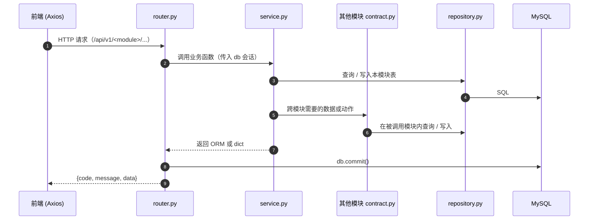
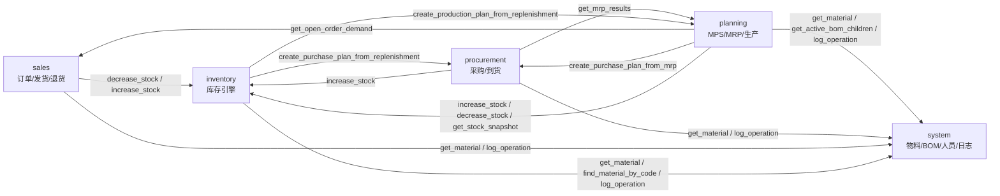
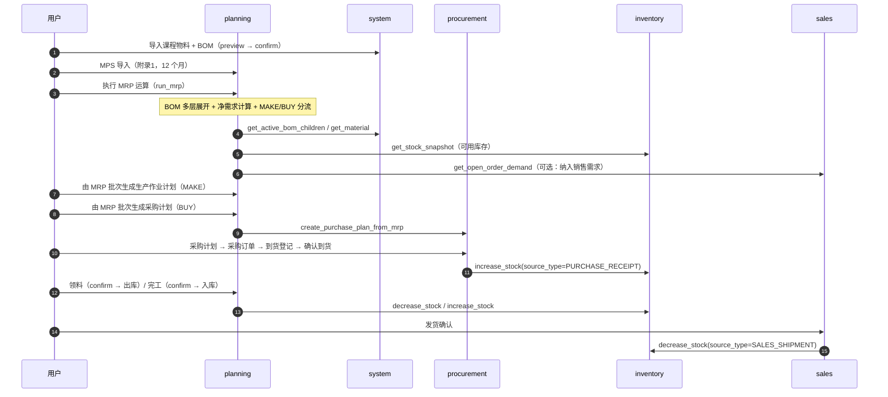
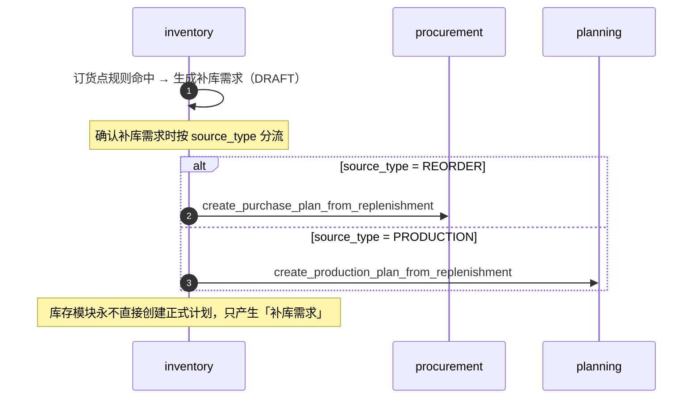

# BH-ERP 系统架构

> 本文描述 BH-ERP 的**真实代码结构**：分层方式、模块边界、数据归属（Owner 原则）、
> 跨模块契约规则，以及一条完整业务闭环的调用路径。
>
> 代码位置：`backend/app/`、`frontend/src/`。
> 相关文档：[`module-ownership.md`](./module-ownership.md)（表级归属）、
> [`data-ownership.md`](./data-ownership.md)（归属规划）、
> [`../database/physical-data-model.md`](../database/physical-data-model.md)（字段级模型）。

## 一、系统定位

BH-ERP 是一个 **MTS（Make To Stock，备货生产）** 模式的 Web ERP，
面向转椅（办公椅）制造企业。它不是「按单生产」：成品库存由主生产计划驱动，
按预测/计划提前生产入库，销售从库存发货。

系统规模（实测）：

| 指标 | 数量 | 核实方式 |
| --- | --- | --- |
| 后端模块 | 5 | `backend/app/main.py` 中 `include_router` 调用 |
| 数据表 | 52 | 内省 `Base.metadata`，见 `../database/physical-data-model.md` |
| REST 接口 | 167 个路径 / 223 个操作 | `app.openapi()`，见 `../api/api-contract.md` |
| 前端路由 | 39 处 `path` 声明（登录 1、布局根 1、404 兜底 1、`dashboard` 1、模块页面 35） | `frontend/src/router/routes.ts` |

## 二、技术栈

| 层 | 技术 | 依据 |
| --- | --- | --- |
| 前端 | Vue 3 + Vite + TypeScript + Pinia + Vue Router + Axios + Element Plus | `frontend/package.json` |
| 后端 | Python + FastAPI + Pydantic v2 + SQLAlchemy 2.x + Alembic + PyMySQL | `backend/requirements.txt` |
| 数据库 | MySQL 8.x，`utf8mb4` | `backend/.env.example`、`docs/database/README.md` |
| 测试 | pytest + httpx | `backend/pytest.ini`、`backend/tests/` |

## 三、分层架构

每个模块**内部结构完全一致**，共 6 个文件：

```
backend/app/
├── main.py                      # create_app()：装配 5 个模块路由 + CORS + 全局异常处理
├── core/
│   ├── config.py                # Settings（pydantic-settings，读 backend/.env）
│   ├── database.py              # Base / engine / SessionLocal / get_db
│   ├── mixins.py                # BigIntPk、CodeStr、Quantity… 与 AuditMixin
│   └── security.py              # 占位认证方案（HTTPBearer，当前不强制鉴权）
├── common/
│   ├── response.py              # ApiResponse、success()、error()
│   ├── pagination.py            # PageParams、PageData
│   └── exceptions.py            # BusinessException + 全局错误码区段
├── shared/
│   ├── enums.py                 # 跨模块共享枚举
│   └── types.py                 # HealthData、AppHealthData
└── modules/<module>/            # 五个模块，结构完全相同
    ├── models.py                # ORM 模型（唯一持有本模块的表定义）
    ├── schemas.py               # Pydantic 入参 / 出参
    ├── repository.py            # 数据访问：只写 SQL，不含业务规则
    ├── service.py               # 业务逻辑：状态机、校验、计算、编排
    ├── contract.py              # 对外契约：其他模块唯一可调用的入口
    └── router.py                # HTTP 层：路径、参数、依赖注入
```

### 3.1 各层职责与硬性约束

| 层 | 只做 | 禁止 |
| --- | --- | --- |
| `router.py` | 定义路径/参数、注入 `db`、把 service 结果包成 `ApiResponse`、`db.commit()` | 写业务规则、直接查库 |
| `service.py` | 业务校验、状态机流转、计算（MRP 展开等）、编排跨模块契约调用 | `db.commit()`（由 router 提交）、直接 import 其他模块的 `models/repository/service` |
| `repository.py` | 单表/多表 SQL 查询与写入、分页 | 业务规则、状态判断、跨模块 join |
| `contract.py` | 把本模块能力暴露成**纯函数**：入参 `db`，返回 `dict`/标量 | `db.commit()`、返回 ORM 对象（防止调用方拿到可变实体） |
| `models.py` | 表结构、`CHECK`/`UNIQUE` 约束、注释 | 跨模块外键（多态引用除外） |

> 「service 不 commit、router 不写业务」这两条是保证 **contract 函数可安全嵌入调用方事务**
> 的前提：库存入库发生在采购到货/生产完工/销售退货的事务里，必须能被一起提交或一起回滚。

### 3.2 请求处理链路



## 四、模块划分与边界

| 模块 | 路由前缀 | 表前缀 | 拥有的领域对象 | 表数 |
| --- | --- | --- | --- | --- |
| system | `/api/v1/system` | `sys_` | 组织、人员、用户、角色、权限、字典、**物料主数据**、**BOM**、工艺路线、操作日志 | 15 |
| sales | `/api/v1/sales` | `sal_` | 客户、销售预测、销售订单、发货、退货 | 8 |
| planning | `/api/v1/planning` | `pln_` | 需求、**MPS**、**MRP**、**生产作业计划**、派工、领料、完工报告 | 10 |
| procurement | `/api/v1/procurement` | `pur_` | 供应商、供应商-物料、采购计划、采购订单、到货、供应商评价 | 9 |
| inventory | `/api/v1/inventory` | `inv_` | 仓库、库位、**库存结存**、**库存流水**、订货点、补库需求、移库、盘点 | 10 |

两个关键边界决定（规格明确要求）：

1. **没有独立的 production 模块**。生产业务（生产作业计划 / 派工 / 领料 / 完工报告）
   全部归 `planning`，因此 `pln_` 前缀下既有计划表也有生产执行表。
2. **物料主数据唯一**。全系统只有 `sys_material` 一张物料表，
   sales / planning / procurement / inventory 一律通过 `system.contract` 读取，
   不各自建「产品表」「原材料表」。

## 五、Owner 原则（数据归属）

> **一张表只能有一个 Owner 模块。只有 Owner 能写这张表。**

| 领域 | Owner | 说明 |
| --- | --- | --- |
| 物料 / BOM / 工艺路线 / 组织 / 人员 / 用户权限 / 字典 / 操作日志 | **system** | 全系统共享的基础数据 |
| 库存（结存 / 流水 / 仓库 / 库位 / 盘点 / 移库 / 订货点 / 补库需求） | **inventory** | 库存引擎，唯一的库存写入者 |
| 销售（客户 / 预测 / 订单 / 发货 / 退货） | **sales** | 订单与出货 |
| 计划与生产（需求 / MPS / MRP / 生产作业计划 / 派工 / 领料 / 完工） | **planning** | 计划 + 生产执行 |
| 采购（供应商 / 采购计划 / 采购订单 / 到货 / 评价） | **procurement** | 采购全流程 |

「写」的例外只有一种合法形式：**调用 Owner 模块 `contract.py` 中显式提供的写入函数**。
例如采购到货要增加库存，只能调 `inventory.contract.increase_stock(...)`，
由 inventory 模块自己写 `inv_transaction` + `inv_balance`。

完整的表级「谁能读、谁能写」矩阵见 [`module-ownership.md`](./module-ownership.md)。

## 六、跨模块契约规则

### 6.1 规则

1. 模块之间**只能**通过对方的 `contract.py` 交互。
2. **禁止** `from app.modules.<其他模块>.models import ...`。
3. **禁止** `from app.modules.<其他模块> import repository / service / schemas`。
4. contract 函数：
   - 不调用 `db.commit()`（运行在调用方事务里）；
   - 返回 `dict` / 标量，**不返回 ORM 实体**；
   - 契约未就绪时抛 `BusinessException(CODE_CONTRACT_NOT_READY, ...)`。
5. 确需跨模块写数据时，必须在**被调用方**的 contract 中新增显式写入函数，
   而不是在调用方直接写对方的表。

### 6.2 实测调用方向

下图由 `grep 'from app.modules.*.contract import'` 实测得出
（箭头 = 调用方 → 被调用方）：



- `system` 是**叶子节点**：不被任何模块调用契约（它也不反向依赖业务模块）。
- `planning → procurement`、`inventory → planning/procurement`、`procurement → planning`
  采用**函数内惰性 import**，以避开模块级循环依赖（如 `planning.service` 在
  `create_purchase_plan_from_run` 内部才 import `procurement.contract`）。

## 七、两条核心业务闭环

### 7.1 计划驱动（MTS 主链路）



### 7.2 库存驱动补库



契约未就绪（对方模块未提供该函数）时抛 `5002 CODE_CONTRACT_NOT_READY`，
并在补库需求上记录 `handled_module` / `handled_ref_id`。

## 八、横切关注点

| 关注点 | 落地方式 | 位置 |
| --- | --- | --- |
| 统一响应 | `{code, message, data}`，`code=0` 表示成功 | `app/common/response.py` |
| 异常处理 | `BusinessException` → HTTP 200 + 业务错误码；校验错误 → HTTP 422 | `app/common/exceptions.py`、`main.py` |
| 分页 | `{page, page_size, total, items}`，默认 20，最大 200 | `app/common/pagination.py` |
| 审计列 | `created_at / updated_at / created_by / updated_by` | `app/core/mixins.py` |
| 操作日志 | `sys_operation_log`，只能经 `system.contract.log_operation` 写入 | `app/modules/system/contract.py` |
| 库存可追溯 | `source_module / source_type / source_reference_id / source_no` | `inv_transaction` |
| CORS | `settings.CORS_ORIGINS` | `app/main.py` |

## 九、前端架构

- 单页应用，`frontend/src/router/routes.ts` 声明式路由，按模块分组。
- 页面与后端模块一一对应：每个后端模块对应一组前端路由前缀
  （`/system/*`、`/sales/*`、`/planning/*`、`/procurement/*`、`/inventory/*`）。
- 统一请求封装由 `frontend/src/` 下的 api/axios 层负责
  （基础地址 `VITE_API_BASE_URL`，开发环境默认 `/api/v1`，
  由 Vite proxy 转发到 `http://127.0.0.1:8000`，见 `frontend/.env.example`）。
- 路由清单与后端接口的对应关系见 [`../api/api-contract.md`](../api/api-contract.md)
  与 [`../user-guide/course-scenario-guide.md`](../user-guide/course-scenario-guide.md)。

## 十、已知简化项

为避免「文档写一套、代码实现另一套」，以下为**当前工程刻意保留的简化**（不影响主链路）：

1. **无鉴权**：`app/core/security.py` 只预留 `HTTPBearer(auto_error=False)`，
   接口不强制携带 `Authorization`；登录接口为演示级（`POST /api/v1/system/auth/login`）。
2. **单号生成为演示级**：`repository.next_no` 采用「计数 + 1」，
   高并发有冲突风险（`inv_transaction` 已做保存点重试一次）。
3. **前端页面未逐一核对到文件级**：本文只描述路由前缀与模块对应关系，
   不列举具体组件文件名。