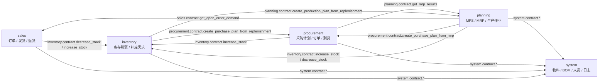

# BH-ERP 全库 ER 图（Entity-Relationship Diagram）

> **生成方式**：由脚本内省 `Base.metadata` 后自动生成；实体、属性、主外键、
> 唯一标记、`ON DELETE` 行为全部取自真实模型，非手工绘制。
>
> - 关系基数：外键所在列为唯一约束时记为 `||--||`（一对一），否则记为 `||--o{`（一对多）。
>   本库 95 条外键中，**1 条为 1:1**（`sys_user.personnel_id` → `sys_personnel.id`），其余 94 条为 1:N。
> - 未标注外键的 `*_id` 字段（如 `source_reference_id`、`created_by`）
>   属于**多态引用 / 弱引用**，按约定不建物理外键，仅建索引，故不出现在关系连线中。
> - 字段类型完整清单见 [`physical-data-model.md`](./physical-data-model.md)。
> - 统计：**52 张表、95 条物理外键关系**。

## 一、模块级依赖（契约调用，非物理外键）

下图是**代码层面的方向**：箭头表示「调用方 import 被调用方的 `contract.py`」，
由 `grep 'from app.modules.*.contract import'` 实测得出。



> 说明：上图中的跨模块 import 均出现在 `service.py`，且指向对方的 `contract.py`；
> 其中 `planning → procurement`、`inventory → planning/procurement`、
> `procurement → planning` 采用**函数内惰性 import** 以避免模块循环依赖。
> `system` 模块**不反向依赖**任何业务模块。

## 二、全库 ER 图（52 张表，仅标注主键与外键列）

为保持可读性，下图中每个实体只列出**主键列与外键列**；完整字段见第三节及
[`physical-data-model.md`](./physical-data-model.md)。

```mermaid
erDiagram
    inv_balance {
        BIGINT id PK "BIGINT"
        BIGINT warehouse_id FK "仓库ID"
        BIGINT location_id FK "库位ID"
        BIGINT material_id FK "物料ID"
    }
    inv_location {
        BIGINT id PK "BIGINT"
        BIGINT warehouse_id FK "仓库ID"
    }
    inv_reorder_rule {
        BIGINT id PK "BIGINT"
        BIGINT material_id FK "物料ID"
        BIGINT warehouse_id FK "仓库ID"
    }
    inv_replenishment_request {
        BIGINT id PK "BIGINT"
        BIGINT material_id FK "物料ID"
        BIGINT warehouse_id FK "仓库ID"
    }
    inv_stocktake {
        BIGINT id PK "BIGINT"
        BIGINT warehouse_id FK "仓库ID"
    }
    inv_stocktake_item {
        BIGINT id PK "BIGINT"
        BIGINT stocktake_id FK "盘点单头ID"
        BIGINT material_id FK "物料ID"
        BIGINT location_id FK "库位ID"
    }
    inv_transaction {
        BIGINT id PK "BIGINT"
        BIGINT material_id FK "物料ID"
        BIGINT warehouse_id FK "仓库ID"
        BIGINT location_id FK "库位ID"
    }
    inv_transfer {
        BIGINT id PK "BIGINT"
        BIGINT from_warehouse_id FK "源仓库ID"
        BIGINT to_warehouse_id FK "目标仓库ID"
    }
    inv_transfer_item {
        BIGINT id PK "BIGINT"
        BIGINT transfer_id FK "移库单头ID"
        BIGINT material_id FK "物料ID"
        BIGINT from_location_id FK "源库位ID"
        BIGINT to_location_id FK "目标库位ID"
    }
    inv_warehouse {
        BIGINT id PK "BIGINT"
        BIGINT org_id FK "所属组织ID"
        BIGINT manager_id FK "仓库负责人（sys_personnel.id）"
    }
    pln_completion_report {
        BIGINT id PK "BIGINT"
        BIGINT plan_id FK "生产作业计划ID"
        BIGINT dispatch_id FK "派工单ID"
        BIGINT material_id FK "产出物料ID"
        BIGINT warehouse_id FK "入库仓库ID"
        BIGINT location_id FK "入库库位ID"
    }
    pln_demand {
        BIGINT id PK "BIGINT"
        BIGINT material_id FK "物料ID"
    }
    pln_dispatch_order {
        BIGINT id PK "BIGINT"
        BIGINT plan_id FK "生产作业计划ID"
        BIGINT worker_id FK "作业人员（sys_personnel.id）"
    }
    pln_material_requisition {
        BIGINT id PK "BIGINT"
        BIGINT plan_id FK "生产作业计划ID"
        BIGINT warehouse_id FK "领料仓库ID"
    }
    pln_material_requisition_item {
        BIGINT id PK "BIGINT"
        BIGINT requisition_id FK "领料单头ID"
        BIGINT material_id FK "物料ID"
        BIGINT location_id FK "领料库位ID"
    }
    pln_mps {
        BIGINT id PK "BIGINT"
    }
    pln_mps_item {
        BIGINT id PK "BIGINT"
        BIGINT mps_id FK "MPS头ID"
        BIGINT material_id FK "产成品物料ID"
    }
    pln_mrp_result {
        BIGINT id PK "BIGINT"
        BIGINT run_id FK "运算批次ID"
        BIGINT material_id FK "物料ID"
        BIGINT parent_material_id FK "父件物料ID（BOM 展开时记录来源母件）"
    }
    pln_mrp_run {
        BIGINT id PK "BIGINT"
        BIGINT mps_id FK "MPS头ID"
    }
    pln_production_plan {
        BIGINT id PK "BIGINT"
        BIGINT mrp_result_id FK "MRP结果ID"
        BIGINT material_id FK "自制件物料ID"
    }
    pur_order {
        BIGINT id PK "BIGINT"
        BIGINT supplier_id FK "供应商ID"
        BIGINT buyer_id FK "采购员（sys_personnel.id）"
    }
    pur_order_item {
        BIGINT id PK "BIGINT"
        BIGINT order_id FK "订单头ID"
        BIGINT material_id FK "物料ID"
    }
    pur_purchase_plan {
        BIGINT id PK "BIGINT"
    }
    pur_purchase_plan_item {
        BIGINT id PK "BIGINT"
        BIGINT plan_id FK "采购计划头ID"
        BIGINT material_id FK "物料ID"
        BIGINT supplier_id FK "建议供应商ID"
    }
    pur_receipt {
        BIGINT id PK "BIGINT"
        BIGINT purchase_order_id FK "采购订单ID"
        BIGINT supplier_id FK "供应商ID"
        BIGINT warehouse_id FK "收货仓库ID"
    }
    pur_receipt_item {
        BIGINT id PK "BIGINT"
        BIGINT receipt_id FK "到货单头ID"
        BIGINT order_item_id FK "采购订单行ID"
        BIGINT material_id FK "物料ID"
        BIGINT location_id FK "收货库位ID"
    }
    pur_supplier {
        BIGINT id PK "BIGINT"
    }
    pur_supplier_evaluation {
        BIGINT id PK "BIGINT"
        BIGINT supplier_id FK "供应商ID"
        BIGINT evaluator_id FK "评价人（sys_personnel.id）"
    }
    pur_supplier_material {
        BIGINT id PK "BIGINT"
        BIGINT supplier_id FK "供应商ID"
        BIGINT material_id FK "物料ID"
    }
    sal_customer {
        BIGINT id PK "BIGINT"
    }
    sal_forecast {
        BIGINT id PK "BIGINT"
        BIGINT customer_id FK "客户ID"
        BIGINT material_id FK "物料ID"
    }
    sal_order {
        BIGINT id PK "BIGINT"
        BIGINT customer_id FK "客户ID"
        BIGINT salesperson_id FK "销售员（sys_personnel.id）"
    }
    sal_order_item {
        BIGINT id PK "BIGINT"
        BIGINT order_id FK "订单头ID"
        BIGINT material_id FK "物料ID"
    }
    sal_return {
        BIGINT id PK "BIGINT"
        BIGINT order_id FK "原销售订单ID"
        BIGINT customer_id FK "客户ID"
    }
    sal_return_item {
        BIGINT id PK "BIGINT"
        BIGINT return_id FK "退货单头ID"
        BIGINT material_id FK "物料ID"
        BIGINT warehouse_id FK "退回仓库ID"
        BIGINT location_id FK "退回库位ID"
    }
    sal_shipment {
        BIGINT id PK "BIGINT"
        BIGINT order_id FK "销售订单ID"
        BIGINT customer_id FK "客户ID"
    }
    sal_shipment_item {
        BIGINT id PK "BIGINT"
        BIGINT shipment_id FK "发货单头ID"
        BIGINT order_item_id FK "销售订单行ID"
        BIGINT material_id FK "物料ID"
        BIGINT warehouse_id FK "发货仓库ID"
        BIGINT location_id FK "发货库位ID"
    }
    sys_bom {
        BIGINT id PK "BIGINT"
        BIGINT material_id FK "母件物料ID（sys_material.id）"
    }
    sys_bom_item {
        BIGINT id PK "BIGINT"
        BIGINT bom_id FK "BOM头ID"
        BIGINT material_id FK "子件物料ID（sys_material.id）"
    }
    sys_dictionary {
        BIGINT id PK "BIGINT"
    }
    sys_dictionary_item {
        BIGINT id PK "BIGINT"
        BIGINT dict_id FK "字典ID"
    }
    sys_material {
        BIGINT id PK "BIGINT"
    }
    sys_operation_log {
        BIGINT id PK "BIGINT"
    }
    sys_organization {
        BIGINT id PK "BIGINT"
        BIGINT parent_id FK "上级组织ID"
    }
    sys_permission {
        BIGINT id PK "BIGINT"
        BIGINT parent_id FK "上级权限ID"
    }
    sys_personnel {
        BIGINT id PK "BIGINT"
        BIGINT org_id FK "所属组织ID"
    }
    sys_role {
        BIGINT id PK "BIGINT"
    }
    sys_role_permission {
        BIGINT id PK "BIGINT"
        BIGINT role_id FK "角色ID"
        BIGINT permission_id FK "权限ID"
    }
    sys_routing {
        BIGINT id PK "BIGINT"
        BIGINT material_id FK "自制件物料ID（sys_material.id）"
    }
    sys_routing_operation {
        BIGINT id PK "BIGINT"
        BIGINT routing_id FK "工艺路线ID"
    }
    sys_user {
        BIGINT id PK "BIGINT"
        BIGINT personnel_id UK,FK "关联员工ID（1:1，可为空）"
    }
    sys_user_role {
        BIGINT id PK "BIGINT"
        BIGINT user_id FK "用户ID"
        BIGINT role_id FK "角色ID"
    }
    inv_location ||--o{ inv_balance : "inv_balance.location_id → inv_location.id (ON DELETE RESTRICT)"
    sys_material ||--o{ inv_balance : "inv_balance.material_id → sys_material.id (ON DELETE RESTRICT)"
    inv_warehouse ||--o{ inv_balance : "inv_balance.warehouse_id → inv_warehouse.id (ON DELETE RESTRICT)"
    inv_warehouse ||--o{ inv_location : "inv_location.warehouse_id → inv_warehouse.id (ON DELETE CASCADE)"
    sys_material ||--o{ inv_reorder_rule : "inv_reorder_rule.material_id → sys_material.id (ON DELETE RESTRICT)"
    inv_warehouse ||--o{ inv_reorder_rule : "inv_reorder_rule.warehouse_id → inv_warehouse.id (ON DELETE RESTRICT)"
    sys_material ||--o{ inv_replenishment_request : "inv_replenishment_request.material_id → sys_material.id (ON DELETE RESTRICT)"
    inv_warehouse ||--o{ inv_replenishment_request : "inv_replenishment_request.warehouse_id → inv_warehouse.id (ON DELETE RESTRICT)"
    inv_warehouse ||--o{ inv_stocktake : "inv_stocktake.warehouse_id → inv_warehouse.id (ON DELETE RESTRICT)"
    inv_location ||--o{ inv_stocktake_item : "inv_stocktake_item.location_id → inv_location.id (ON DELETE RESTRICT)"
    sys_material ||--o{ inv_stocktake_item : "inv_stocktake_item.material_id → sys_material.id (ON DELETE RESTRICT)"
    inv_stocktake ||--o{ inv_stocktake_item : "inv_stocktake_item.stocktake_id → inv_stocktake.id (ON DELETE CASCADE)"
    inv_location ||--o{ inv_transaction : "inv_transaction.location_id → inv_location.id (ON DELETE RESTRICT)"
    sys_material ||--o{ inv_transaction : "inv_transaction.material_id → sys_material.id (ON DELETE RESTRICT)"
    inv_warehouse ||--o{ inv_transaction : "inv_transaction.warehouse_id → inv_warehouse.id (ON DELETE RESTRICT)"
    inv_warehouse ||--o{ inv_transfer : "inv_transfer.from_warehouse_id → inv_warehouse.id (ON DELETE RESTRICT)"
    inv_warehouse ||--o{ inv_transfer : "inv_transfer.to_warehouse_id → inv_warehouse.id (ON DELETE RESTRICT)"
    inv_location ||--o{ inv_transfer_item : "inv_transfer_item.from_location_id → inv_location.id (ON DELETE RESTRICT)"
    sys_material ||--o{ inv_transfer_item : "inv_transfer_item.material_id → sys_material.id (ON DELETE RESTRICT)"
    inv_location ||--o{ inv_transfer_item : "inv_transfer_item.to_location_id → inv_location.id (ON DELETE RESTRICT)"
    inv_transfer ||--o{ inv_transfer_item : "inv_transfer_item.transfer_id → inv_transfer.id (ON DELETE CASCADE)"
    sys_personnel ||--o{ inv_warehouse : "inv_warehouse.manager_id → sys_personnel.id (ON DELETE RESTRICT)"
    sys_organization ||--o{ inv_warehouse : "inv_warehouse.org_id → sys_organization.id (ON DELETE RESTRICT)"
    pln_dispatch_order ||--o{ pln_completion_report : "pln_completion_report.dispatch_id → pln_dispatch_order.id (ON DELETE RESTRICT)"
    inv_location ||--o{ pln_completion_report : "pln_completion_report.location_id → inv_location.id (ON DELETE RESTRICT)"
    sys_material ||--o{ pln_completion_report : "pln_completion_report.material_id → sys_material.id (ON DELETE RESTRICT)"
    pln_production_plan ||--o{ pln_completion_report : "pln_completion_report.plan_id → pln_production_plan.id (ON DELETE RESTRICT)"
    inv_warehouse ||--o{ pln_completion_report : "pln_completion_report.warehouse_id → inv_warehouse.id (ON DELETE RESTRICT)"
    sys_material ||--o{ pln_demand : "pln_demand.material_id → sys_material.id (ON DELETE RESTRICT)"
    pln_production_plan ||--o{ pln_dispatch_order : "pln_dispatch_order.plan_id → pln_production_plan.id (ON DELETE RESTRICT)"
    sys_personnel ||--o{ pln_dispatch_order : "pln_dispatch_order.worker_id → sys_personnel.id (ON DELETE RESTRICT)"
    pln_production_plan ||--o{ pln_material_requisition : "pln_material_requisition.plan_id → pln_production_plan.id (ON DELETE RESTRICT)"
    inv_warehouse ||--o{ pln_material_requisition : "pln_material_requisition.warehouse_id → inv_warehouse.id (ON DELETE RESTRICT)"
    inv_location ||--o{ pln_material_requisition_item : "pln_material_requisition_item.location_id → inv_location.id (ON DELETE RESTRICT)"
    sys_material ||--o{ pln_material_requisition_item : "pln_material_requisition_item.material_id → sys_material.id (ON DELETE RESTRICT)"
    pln_material_requisition ||--o{ pln_material_requisition_item : "pln_material_requisition_item.requisition_id → pln_material_requisition.id (ON DELETE CASCADE)"
    sys_material ||--o{ pln_mps_item : "pln_mps_item.material_id → sys_material.id (ON DELETE RESTRICT)"
    pln_mps ||--o{ pln_mps_item : "pln_mps_item.mps_id → pln_mps.id (ON DELETE CASCADE)"
    sys_material ||--o{ pln_mrp_result : "pln_mrp_result.material_id → sys_material.id (ON DELETE RESTRICT)"
    sys_material ||--o{ pln_mrp_result : "pln_mrp_result.parent_material_id → sys_material.id (ON DELETE RESTRICT)"
    pln_mrp_run ||--o{ pln_mrp_result : "pln_mrp_result.run_id → pln_mrp_run.id (ON DELETE CASCADE)"
    pln_mps ||--o{ pln_mrp_run : "pln_mrp_run.mps_id → pln_mps.id (ON DELETE RESTRICT)"
    sys_material ||--o{ pln_production_plan : "pln_production_plan.material_id → sys_material.id (ON DELETE RESTRICT)"
    pln_mrp_result ||--o{ pln_production_plan : "pln_production_plan.mrp_result_id → pln_mrp_result.id (ON DELETE RESTRICT)"
    sys_personnel ||--o{ pur_order : "pur_order.buyer_id → sys_personnel.id (ON DELETE RESTRICT)"
    pur_supplier ||--o{ pur_order : "pur_order.supplier_id → pur_supplier.id (ON DELETE RESTRICT)"
    sys_material ||--o{ pur_order_item : "pur_order_item.material_id → sys_material.id (ON DELETE RESTRICT)"
    pur_order ||--o{ pur_order_item : "pur_order_item.order_id → pur_order.id (ON DELETE CASCADE)"
    sys_material ||--o{ pur_purchase_plan_item : "pur_purchase_plan_item.material_id → sys_material.id (ON DELETE RESTRICT)"
    pur_purchase_plan ||--o{ pur_purchase_plan_item : "pur_purchase_plan_item.plan_id → pur_purchase_plan.id (ON DELETE CASCADE)"
    pur_supplier ||--o{ pur_purchase_plan_item : "pur_purchase_plan_item.supplier_id → pur_supplier.id (ON DELETE RESTRICT)"
    pur_order ||--o{ pur_receipt : "pur_receipt.purchase_order_id → pur_order.id (ON DELETE RESTRICT)"
    pur_supplier ||--o{ pur_receipt : "pur_receipt.supplier_id → pur_supplier.id (ON DELETE RESTRICT)"
    inv_warehouse ||--o{ pur_receipt : "pur_receipt.warehouse_id → inv_warehouse.id (ON DELETE RESTRICT)"
    inv_location ||--o{ pur_receipt_item : "pur_receipt_item.location_id → inv_location.id (ON DELETE RESTRICT)"
    sys_material ||--o{ pur_receipt_item : "pur_receipt_item.material_id → sys_material.id (ON DELETE RESTRICT)"
    pur_order_item ||--o{ pur_receipt_item : "pur_receipt_item.order_item_id → pur_order_item.id (ON DELETE RESTRICT)"
    pur_receipt ||--o{ pur_receipt_item : "pur_receipt_item.receipt_id → pur_receipt.id (ON DELETE CASCADE)"
    sys_personnel ||--o{ pur_supplier_evaluation : "pur_supplier_evaluation.evaluator_id → sys_personnel.id (ON DELETE RESTRICT)"
    pur_supplier ||--o{ pur_supplier_evaluation : "pur_supplier_evaluation.supplier_id → pur_supplier.id (ON DELETE CASCADE)"
    sys_material ||--o{ pur_supplier_material : "pur_supplier_material.material_id → sys_material.id (ON DELETE RESTRICT)"
    pur_supplier ||--o{ pur_supplier_material : "pur_supplier_material.supplier_id → pur_supplier.id (ON DELETE CASCADE)"
    sal_customer ||--o{ sal_forecast : "sal_forecast.customer_id → sal_customer.id (ON DELETE RESTRICT)"
    sys_material ||--o{ sal_forecast : "sal_forecast.material_id → sys_material.id (ON DELETE RESTRICT)"
    sal_customer ||--o{ sal_order : "sal_order.customer_id → sal_customer.id (ON DELETE RESTRICT)"
    sys_personnel ||--o{ sal_order : "sal_order.salesperson_id → sys_personnel.id (ON DELETE RESTRICT)"
    sys_material ||--o{ sal_order_item : "sal_order_item.material_id → sys_material.id (ON DELETE RESTRICT)"
    sal_order ||--o{ sal_order_item : "sal_order_item.order_id → sal_order.id (ON DELETE CASCADE)"
    sal_customer ||--o{ sal_return : "sal_return.customer_id → sal_customer.id (ON DELETE RESTRICT)"
    sal_order ||--o{ sal_return : "sal_return.order_id → sal_order.id (ON DELETE RESTRICT)"
    inv_location ||--o{ sal_return_item : "sal_return_item.location_id → inv_location.id (ON DELETE RESTRICT)"
    sys_material ||--o{ sal_return_item : "sal_return_item.material_id → sys_material.id (ON DELETE RESTRICT)"
    sal_return ||--o{ sal_return_item : "sal_return_item.return_id → sal_return.id (ON DELETE CASCADE)"
    inv_warehouse ||--o{ sal_return_item : "sal_return_item.warehouse_id → inv_warehouse.id (ON DELETE RESTRICT)"
    sal_customer ||--o{ sal_shipment : "sal_shipment.customer_id → sal_customer.id (ON DELETE RESTRICT)"
    sal_order ||--o{ sal_shipment : "sal_shipment.order_id → sal_order.id (ON DELETE RESTRICT)"
    inv_location ||--o{ sal_shipment_item : "sal_shipment_item.location_id → inv_location.id (ON DELETE RESTRICT)"
    sys_material ||--o{ sal_shipment_item : "sal_shipment_item.material_id → sys_material.id (ON DELETE RESTRICT)"
    sal_order_item ||--o{ sal_shipment_item : "sal_shipment_item.order_item_id → sal_order_item.id (ON DELETE RESTRICT)"
    sal_shipment ||--o{ sal_shipment_item : "sal_shipment_item.shipment_id → sal_shipment.id (ON DELETE CASCADE)"
    inv_warehouse ||--o{ sal_shipment_item : "sal_shipment_item.warehouse_id → inv_warehouse.id (ON DELETE RESTRICT)"
    sys_material ||--o{ sys_bom : "sys_bom.material_id → sys_material.id (ON DELETE RESTRICT)"
    sys_bom ||--o{ sys_bom_item : "sys_bom_item.bom_id → sys_bom.id (ON DELETE CASCADE)"
    sys_material ||--o{ sys_bom_item : "sys_bom_item.material_id → sys_material.id (ON DELETE RESTRICT)"
    sys_dictionary ||--o{ sys_dictionary_item : "sys_dictionary_item.dict_id → sys_dictionary.id (ON DELETE CASCADE)"
    sys_organization ||--o{ sys_organization : "sys_organization.parent_id → sys_organization.id (ON DELETE RESTRICT)"
    sys_permission ||--o{ sys_permission : "sys_permission.parent_id → sys_permission.id (ON DELETE RESTRICT)"
    sys_organization ||--o{ sys_personnel : "sys_personnel.org_id → sys_organization.id (ON DELETE RESTRICT)"
    sys_permission ||--o{ sys_role_permission : "sys_role_permission.permission_id → sys_permission.id (ON DELETE CASCADE)"
    sys_role ||--o{ sys_role_permission : "sys_role_permission.role_id → sys_role.id (ON DELETE CASCADE)"
    sys_material ||--o{ sys_routing : "sys_routing.material_id → sys_material.id (ON DELETE RESTRICT)"
    sys_routing ||--o{ sys_routing_operation : "sys_routing_operation.routing_id → sys_routing.id (ON DELETE CASCADE)"
    sys_personnel ||--|| sys_user : "sys_user.personnel_id → sys_personnel.id (ON DELETE RESTRICT)"
    sys_role ||--o{ sys_user_role : "sys_user_role.role_id → sys_role.id (ON DELETE CASCADE)"
    sys_user ||--o{ sys_user_role : "sys_user_role.user_id → sys_user.id (ON DELETE CASCADE)"
```

## 三、分模块 ER 图（含全部字段）

### 3.1 系统基础数据 模块（`sys_`）

单模块全字段 ER 图另见 [`system-er.md`](./system-er.md)。

### 3.2 销售管理 模块（`sal_`）

单模块全字段 ER 图另见 [`sales-er.md`](./sales-er.md)。

### 3.3 计划管理 模块（`pln_`）

单模块全字段 ER 图另见 [`planning-er.md`](./planning-er.md)。

### 3.4 采购管理 模块（`pur_`）

单模块全字段 ER 图另见 [`procurement-er.md`](./procurement-er.md)。

### 3.5 库存管理 模块（`inv_`）

单模块全字段 ER 图另见 [`inventory-er.md`](./inventory-er.md)。

## 四、跨模块外键清单（共 95 条）

下表按「子表 → 父表」列出**全部**物理外键，含 `ON DELETE` 行为。

| 子表（模块） | 子列 | 父表（模块） | ON DELETE | 是否跨模块 |
| --- | --- | --- | --- | --- |
| `inv_balance`（inventory） | `location_id` | `inv_location`（inventory） | RESTRICT | 否 |
| `inv_balance`（inventory） | `material_id` | `sys_material`（system） | RESTRICT | **是** |
| `inv_balance`（inventory） | `warehouse_id` | `inv_warehouse`（inventory） | RESTRICT | 否 |
| `inv_location`（inventory） | `warehouse_id` | `inv_warehouse`（inventory） | CASCADE | 否 |
| `inv_reorder_rule`（inventory） | `material_id` | `sys_material`（system） | RESTRICT | **是** |
| `inv_reorder_rule`（inventory） | `warehouse_id` | `inv_warehouse`（inventory） | RESTRICT | 否 |
| `inv_replenishment_request`（inventory） | `material_id` | `sys_material`（system） | RESTRICT | **是** |
| `inv_replenishment_request`（inventory） | `warehouse_id` | `inv_warehouse`（inventory） | RESTRICT | 否 |
| `inv_stocktake`（inventory） | `warehouse_id` | `inv_warehouse`（inventory） | RESTRICT | 否 |
| `inv_stocktake_item`（inventory） | `location_id` | `inv_location`（inventory） | RESTRICT | 否 |
| `inv_stocktake_item`（inventory） | `material_id` | `sys_material`（system） | RESTRICT | **是** |
| `inv_stocktake_item`（inventory） | `stocktake_id` | `inv_stocktake`（inventory） | CASCADE | 否 |
| `inv_transaction`（inventory） | `location_id` | `inv_location`（inventory） | RESTRICT | 否 |
| `inv_transaction`（inventory） | `material_id` | `sys_material`（system） | RESTRICT | **是** |
| `inv_transaction`（inventory） | `warehouse_id` | `inv_warehouse`（inventory） | RESTRICT | 否 |
| `inv_transfer`（inventory） | `from_warehouse_id` | `inv_warehouse`（inventory） | RESTRICT | 否 |
| `inv_transfer`（inventory） | `to_warehouse_id` | `inv_warehouse`（inventory） | RESTRICT | 否 |
| `inv_transfer_item`（inventory） | `from_location_id` | `inv_location`（inventory） | RESTRICT | 否 |
| `inv_transfer_item`（inventory） | `material_id` | `sys_material`（system） | RESTRICT | **是** |
| `inv_transfer_item`（inventory） | `to_location_id` | `inv_location`（inventory） | RESTRICT | 否 |
| `inv_transfer_item`（inventory） | `transfer_id` | `inv_transfer`（inventory） | CASCADE | 否 |
| `inv_warehouse`（inventory） | `manager_id` | `sys_personnel`（system） | RESTRICT | **是** |
| `inv_warehouse`（inventory） | `org_id` | `sys_organization`（system） | RESTRICT | **是** |
| `pln_completion_report`（planning） | `dispatch_id` | `pln_dispatch_order`（planning） | RESTRICT | 否 |
| `pln_completion_report`（planning） | `location_id` | `inv_location`（inventory） | RESTRICT | **是** |
| `pln_completion_report`（planning） | `material_id` | `sys_material`（system） | RESTRICT | **是** |
| `pln_completion_report`（planning） | `plan_id` | `pln_production_plan`（planning） | RESTRICT | 否 |
| `pln_completion_report`（planning） | `warehouse_id` | `inv_warehouse`（inventory） | RESTRICT | **是** |
| `pln_demand`（planning） | `material_id` | `sys_material`（system） | RESTRICT | **是** |
| `pln_dispatch_order`（planning） | `plan_id` | `pln_production_plan`（planning） | RESTRICT | 否 |
| `pln_dispatch_order`（planning） | `worker_id` | `sys_personnel`（system） | RESTRICT | **是** |
| `pln_material_requisition`（planning） | `plan_id` | `pln_production_plan`（planning） | RESTRICT | 否 |
| `pln_material_requisition`（planning） | `warehouse_id` | `inv_warehouse`（inventory） | RESTRICT | **是** |
| `pln_material_requisition_item`（planning） | `location_id` | `inv_location`（inventory） | RESTRICT | **是** |
| `pln_material_requisition_item`（planning） | `material_id` | `sys_material`（system） | RESTRICT | **是** |
| `pln_material_requisition_item`（planning） | `requisition_id` | `pln_material_requisition`（planning） | CASCADE | 否 |
| `pln_mps_item`（planning） | `material_id` | `sys_material`（system） | RESTRICT | **是** |
| `pln_mps_item`（planning） | `mps_id` | `pln_mps`（planning） | CASCADE | 否 |
| `pln_mrp_result`（planning） | `material_id` | `sys_material`（system） | RESTRICT | **是** |
| `pln_mrp_result`（planning） | `parent_material_id` | `sys_material`（system） | RESTRICT | **是** |
| `pln_mrp_result`（planning） | `run_id` | `pln_mrp_run`（planning） | CASCADE | 否 |
| `pln_mrp_run`（planning） | `mps_id` | `pln_mps`（planning） | RESTRICT | 否 |
| `pln_production_plan`（planning） | `material_id` | `sys_material`（system） | RESTRICT | **是** |
| `pln_production_plan`（planning） | `mrp_result_id` | `pln_mrp_result`（planning） | RESTRICT | 否 |
| `pur_order`（procurement） | `buyer_id` | `sys_personnel`（system） | RESTRICT | **是** |
| `pur_order`（procurement） | `supplier_id` | `pur_supplier`（procurement） | RESTRICT | 否 |
| `pur_order_item`（procurement） | `material_id` | `sys_material`（system） | RESTRICT | **是** |
| `pur_order_item`（procurement） | `order_id` | `pur_order`（procurement） | CASCADE | 否 |
| `pur_purchase_plan_item`（procurement） | `material_id` | `sys_material`（system） | RESTRICT | **是** |
| `pur_purchase_plan_item`（procurement） | `plan_id` | `pur_purchase_plan`（procurement） | CASCADE | 否 |
| `pur_purchase_plan_item`（procurement） | `supplier_id` | `pur_supplier`（procurement） | RESTRICT | 否 |
| `pur_receipt`（procurement） | `purchase_order_id` | `pur_order`（procurement） | RESTRICT | 否 |
| `pur_receipt`（procurement） | `supplier_id` | `pur_supplier`（procurement） | RESTRICT | 否 |
| `pur_receipt`（procurement） | `warehouse_id` | `inv_warehouse`（inventory） | RESTRICT | **是** |
| `pur_receipt_item`（procurement） | `location_id` | `inv_location`（inventory） | RESTRICT | **是** |
| `pur_receipt_item`（procurement） | `material_id` | `sys_material`（system） | RESTRICT | **是** |
| `pur_receipt_item`（procurement） | `order_item_id` | `pur_order_item`（procurement） | RESTRICT | 否 |
| `pur_receipt_item`（procurement） | `receipt_id` | `pur_receipt`（procurement） | CASCADE | 否 |
| `pur_supplier_evaluation`（procurement） | `evaluator_id` | `sys_personnel`（system） | RESTRICT | **是** |
| `pur_supplier_evaluation`（procurement） | `supplier_id` | `pur_supplier`（procurement） | CASCADE | 否 |
| `pur_supplier_material`（procurement） | `material_id` | `sys_material`（system） | RESTRICT | **是** |
| `pur_supplier_material`（procurement） | `supplier_id` | `pur_supplier`（procurement） | CASCADE | 否 |
| `sal_forecast`（sales） | `customer_id` | `sal_customer`（sales） | RESTRICT | 否 |
| `sal_forecast`（sales） | `material_id` | `sys_material`（system） | RESTRICT | **是** |
| `sal_order`（sales） | `customer_id` | `sal_customer`（sales） | RESTRICT | 否 |
| `sal_order`（sales） | `salesperson_id` | `sys_personnel`（system） | RESTRICT | **是** |
| `sal_order_item`（sales） | `material_id` | `sys_material`（system） | RESTRICT | **是** |
| `sal_order_item`（sales） | `order_id` | `sal_order`（sales） | CASCADE | 否 |
| `sal_return`（sales） | `customer_id` | `sal_customer`（sales） | RESTRICT | 否 |
| `sal_return`（sales） | `order_id` | `sal_order`（sales） | RESTRICT | 否 |
| `sal_return_item`（sales） | `location_id` | `inv_location`（inventory） | RESTRICT | **是** |
| `sal_return_item`（sales） | `material_id` | `sys_material`（system） | RESTRICT | **是** |
| `sal_return_item`（sales） | `return_id` | `sal_return`（sales） | CASCADE | 否 |
| `sal_return_item`（sales） | `warehouse_id` | `inv_warehouse`（inventory） | RESTRICT | **是** |
| `sal_shipment`（sales） | `customer_id` | `sal_customer`（sales） | RESTRICT | 否 |
| `sal_shipment`（sales） | `order_id` | `sal_order`（sales） | RESTRICT | 否 |
| `sal_shipment_item`（sales） | `location_id` | `inv_location`（inventory） | RESTRICT | **是** |
| `sal_shipment_item`（sales） | `material_id` | `sys_material`（system） | RESTRICT | **是** |
| `sal_shipment_item`（sales） | `order_item_id` | `sal_order_item`（sales） | RESTRICT | 否 |
| `sal_shipment_item`（sales） | `shipment_id` | `sal_shipment`（sales） | CASCADE | 否 |
| `sal_shipment_item`（sales） | `warehouse_id` | `inv_warehouse`（inventory） | RESTRICT | **是** |
| `sys_bom`（system） | `material_id` | `sys_material`（system） | RESTRICT | 否 |
| `sys_bom_item`（system） | `bom_id` | `sys_bom`（system） | CASCADE | 否 |
| `sys_bom_item`（system） | `material_id` | `sys_material`（system） | RESTRICT | 否 |
| `sys_dictionary_item`（system） | `dict_id` | `sys_dictionary`（system） | CASCADE | 否 |
| `sys_organization`（system） | `parent_id` | `sys_organization`（system） | RESTRICT | 否 |
| `sys_permission`（system） | `parent_id` | `sys_permission`（system） | RESTRICT | 否 |
| `sys_personnel`（system） | `org_id` | `sys_organization`（system） | RESTRICT | 否 |
| `sys_role_permission`（system） | `permission_id` | `sys_permission`（system） | CASCADE | 否 |
| `sys_role_permission`（system） | `role_id` | `sys_role`（system） | CASCADE | 否 |
| `sys_routing`（system） | `material_id` | `sys_material`（system） | RESTRICT | 否 |
| `sys_routing_operation`（system） | `routing_id` | `sys_routing`（system） | CASCADE | 否 |
| `sys_user`（system） | `personnel_id` | `sys_personnel`（system） | RESTRICT | 否 |
| `sys_user_role`（system） | `role_id` | `sys_role`（system） | CASCADE | 否 |
| `sys_user_role`（system） | `user_id` | `sys_user`（system） | CASCADE | 否 |

> 其中跨模块物理外键 **37** 条，全部为指向 `sys_material.id` 的物料引用
> （由 system 模块统一拥有物料主数据）。
