# 库存管理 模块 ER 图（`inv_`）

> 自动内省 `Base.metadata` 生成；本文件只覆盖 `inv_` 前缀的 10 张表。
> 全库关系与跨模块外键见 [`full-er-diagram.md`](./full-er-diagram.md)，
> 字段完整说明见 [`physical-data-model.md`](./physical-data-model.md)。

## 一、本模块表清单

| 表名 | ORM 类 | 说明 | 字段数 |
| --- | --- | --- | --- |
| `inv_balance` | `InvBalance` | 库存结存：某仓库/库位下某物料的当前数量 | 11 |
| `inv_location` | `InvLocation` | 库位（仓库下的具体存放位置） | 10 |
| `inv_reorder_rule` | `InvReorderRule` | 订货点规则：库存低于 `reorder_point` 时触发补库建议 | 11 |
| `inv_replenishment_request` | `InvReplenishmentRequest` | 补库需求单 | 17 |
| `inv_stocktake` | `InvStocktake` | 库存盘点单头 | 10 |
| `inv_stocktake_item` | `InvStocktakeItem` | 盘点明细行：账面数 vs 实盘数，差异通过 `ADJUST` 流水调整 | 12 |
| `inv_transaction` | `InvTransaction` | 库存流水（出入库明细）—— 库存变动的唯一入口与审计凭证 | 20 |
| `inv_transfer` | `InvTransfer` | 移库单头：仓库/库位之间的库存移动 | 11 |
| `inv_transfer_item` | `InvTransferItem` | 移库明细行 | 11 |
| `inv_warehouse` | `InvWarehouse` | 仓库 | 12 |

## 二、ER 图（含全部字段）

```mermaid
erDiagram
    inv_balance {
        BIGINT id PK "BIGINT"
        BIGINT warehouse_id FK "仓库ID"
        BIGINT location_id FK "库位ID"
        BIGINT material_id FK "物料ID"
        DECIMAL quantity "库存数量"
        DECIMAL locked_quantity "锁定量（已分配未出库）"
        DATETIME updated_at_txn "最近一次变动时间"
        BIGINT created_by "创建人ID（sys_user.id）"
        BIGINT updated_by "更新人ID（sys_user.id）"
        DATETIME created_at "创建时间"
        DATETIME updated_at "更新时间"
    }
    inv_location {
        BIGINT id PK "BIGINT"
        VARCHAR location_code "库位编码"
        VARCHAR location_name "库位名称"
        BIGINT warehouse_id FK "仓库ID"
        VARCHAR status "状态"
        TEXT remark "备注"
        BIGINT created_by "创建人ID（sys_user.id）"
        BIGINT updated_by "更新人ID（sys_user.id）"
        DATETIME created_at "创建时间"
        DATETIME updated_at "更新时间"
    }
    inv_reorder_rule {
        BIGINT id PK "BIGINT"
        BIGINT material_id FK "物料ID"
        BIGINT warehouse_id FK "仓库ID"
        DECIMAL reorder_point "订货点"
        DECIMAL reorder_quantity "建议订货量"
        VARCHAR status "状态"
        TEXT remark "备注"
        BIGINT created_by "创建人ID（sys_user.id）"
        BIGINT updated_by "更新人ID（sys_user.id）"
        DATETIME created_at "创建时间"
        DATETIME updated_at "更新时间"
    }
    inv_replenishment_request {
        BIGINT id PK "BIGINT"
        VARCHAR request_no UK "补库需求单号"
        BIGINT material_id FK "物料ID"
        BIGINT warehouse_id FK "仓库ID"
        DECIMAL request_qty "补库数量"
        DECIMAL current_qty "触发时库存量"
        DECIMAL target_qty "目标库存量"
        DATE required_date "需求日期"
        VARCHAR source_type "来源 REORDER/PRODUCTION"
        VARCHAR status "状态"
        VARCHAR handled_module "受理模块"
        BIGINT handled_ref_id "受理单据ID"
        TEXT remark "备注"
        BIGINT created_by "创建人ID（sys_user.id）"
        BIGINT updated_by "更新人ID（sys_user.id）"
        DATETIME created_at "创建时间"
        DATETIME updated_at "更新时间"
    }
    inv_stocktake {
        BIGINT id PK "BIGINT"
        VARCHAR stocktake_no UK "盘点单号"
        BIGINT warehouse_id FK "仓库ID"
        DATE stocktake_date "盘点日期"
        VARCHAR status "状态"
        TEXT remark "备注"
        BIGINT created_by "创建人ID（sys_user.id）"
        BIGINT updated_by "更新人ID（sys_user.id）"
        DATETIME created_at "创建时间"
        DATETIME updated_at "更新时间"
    }
    inv_stocktake_item {
        BIGINT id PK "BIGINT"
        BIGINT stocktake_id FK "盘点单头ID"
        BIGINT material_id FK "物料ID"
        BIGINT location_id FK "库位ID"
        DECIMAL book_qty "账面数量"
        DECIMAL actual_qty "实盘数量"
        DECIMAL difference "差异数量"
        VARCHAR remark "备注"
        BIGINT created_by "创建人ID（sys_user.id）"
        BIGINT updated_by "更新人ID（sys_user.id）"
        DATETIME created_at "创建时间"
        DATETIME updated_at "更新时间"
    }
    inv_transaction {
        BIGINT id PK "BIGINT"
        VARCHAR transaction_no UK "流水单号"
        VARCHAR transaction_type "类型 IN/OUT/TRANSFER_IN/TRANSFER_OUT/ADJUST"
        BIGINT material_id FK "物料ID"
        BIGINT warehouse_id FK "仓库ID"
        BIGINT location_id FK "库位ID"
        DECIMAL quantity_change "变动数量（入库为正，出库为负）"
        DECIMAL quantity_after "变动后结存"
        DECIMAL unit_cost "单位成本"
        DATE biz_date "业务日期"
        VARCHAR source_module "来源模块"
        VARCHAR source_type "来源业务类型（PURCHASE_RECEIPT 等）"
        BIGINT source_reference_id "来源单据ID"
        VARCHAR source_no "来源单号（冗余便于查询）"
        BIGINT operator_id "操作人ID（sys_user.id）"
        VARCHAR remark "备注"
        BIGINT created_by "创建人ID（sys_user.id）"
        BIGINT updated_by "更新人ID（sys_user.id）"
        DATETIME created_at "创建时间"
        DATETIME updated_at "更新时间"
    }
    inv_transfer {
        BIGINT id PK "BIGINT"
        VARCHAR transfer_no UK "移库单号"
        BIGINT from_warehouse_id FK "源仓库ID"
        BIGINT to_warehouse_id FK "目标仓库ID"
        DATE transfer_date "移库日期"
        VARCHAR status "状态"
        TEXT remark "备注"
        BIGINT created_by "创建人ID（sys_user.id）"
        BIGINT updated_by "更新人ID（sys_user.id）"
        DATETIME created_at "创建时间"
        DATETIME updated_at "更新时间"
    }
    inv_transfer_item {
        BIGINT id PK "BIGINT"
        BIGINT transfer_id FK "移库单头ID"
        BIGINT material_id FK "物料ID"
        BIGINT from_location_id FK "源库位ID"
        BIGINT to_location_id FK "目标库位ID"
        DECIMAL quantity "移库数量"
        VARCHAR remark "备注"
        BIGINT created_by "创建人ID（sys_user.id）"
        BIGINT updated_by "更新人ID（sys_user.id）"
        DATETIME created_at "创建时间"
        DATETIME updated_at "更新时间"
    }
    inv_warehouse {
        BIGINT id PK "BIGINT"
        VARCHAR warehouse_code UK "仓库编码"
        VARCHAR warehouse_name "仓库名称"
        BIGINT org_id FK "所属组织ID"
        BIGINT manager_id FK "仓库负责人（sys_personnel.id）"
        VARCHAR address "地址"
        VARCHAR status "状态"
        TEXT remark "备注"
        BIGINT created_by "创建人ID（sys_user.id）"
        BIGINT updated_by "更新人ID（sys_user.id）"
        DATETIME created_at "创建时间"
        DATETIME updated_at "更新时间"
    }
    inv_location ||--o{ inv_balance : "inv_balance.location_id → inv_location.id (ON DELETE RESTRICT)"
    sys_material ||--o{ inv_balance : "inv_balance.material_id → sys_material.id (ON DELETE RESTRICT)"
    inv_warehouse ||--o{ inv_balance : "inv_balance.warehouse_id → inv_warehouse.id (ON DELETE RESTRICT)"
    inv_warehouse ||--o{ inv_location : "inv_location.warehouse_id → inv_warehouse.id (ON DELETE CASCADE)"
    sys_material ||--o{ inv_reorder_rule : "inv_reorder_rule.material_id → sys_material.id (ON DELETE RESTRICT)"
    inv_warehouse ||--o{ inv_reorder_rule : "inv_reorder_rule.warehouse_id → inv_warehouse.id (ON DELETE RESTRICT)"
    sys_material ||--o{ inv_replenishment_request : "inv_replenishment_request.material_id → sys_material.id (ON DELETE RESTRICT)"
    inv_warehouse ||--o{ inv_replenishment_request : "inv_replenishment_request.warehouse_id → inv_warehouse.id (ON DELETE RESTRICT)"
    inv_warehouse ||--o{ inv_stocktake : "inv_stocktake.warehouse_id → inv_warehouse.id (ON DELETE RESTRICT)"
    inv_location ||--o{ inv_stocktake_item : "inv_stocktake_item.location_id → inv_location.id (ON DELETE RESTRICT)"
    sys_material ||--o{ inv_stocktake_item : "inv_stocktake_item.material_id → sys_material.id (ON DELETE RESTRICT)"
    inv_stocktake ||--o{ inv_stocktake_item : "inv_stocktake_item.stocktake_id → inv_stocktake.id (ON DELETE CASCADE)"
    inv_location ||--o{ inv_transaction : "inv_transaction.location_id → inv_location.id (ON DELETE RESTRICT)"
    sys_material ||--o{ inv_transaction : "inv_transaction.material_id → sys_material.id (ON DELETE RESTRICT)"
    inv_warehouse ||--o{ inv_transaction : "inv_transaction.warehouse_id → inv_warehouse.id (ON DELETE RESTRICT)"
    inv_warehouse ||--o{ inv_transfer : "inv_transfer.from_warehouse_id → inv_warehouse.id (ON DELETE RESTRICT)"
    inv_warehouse ||--o{ inv_transfer : "inv_transfer.to_warehouse_id → inv_warehouse.id (ON DELETE RESTRICT)"
    inv_location ||--o{ inv_transfer_item : "inv_transfer_item.from_location_id → inv_location.id (ON DELETE RESTRICT)"
    sys_material ||--o{ inv_transfer_item : "inv_transfer_item.material_id → sys_material.id (ON DELETE RESTRICT)"
    inv_location ||--o{ inv_transfer_item : "inv_transfer_item.to_location_id → inv_location.id (ON DELETE RESTRICT)"
    inv_transfer ||--o{ inv_transfer_item : "inv_transfer_item.transfer_id → inv_transfer.id (ON DELETE CASCADE)"
    sys_personnel ||--o{ inv_warehouse : "inv_warehouse.manager_id → sys_personnel.id (ON DELETE RESTRICT)"
    sys_organization ||--o{ inv_warehouse : "inv_warehouse.org_id → sys_organization.id (ON DELETE RESTRICT)"
```

## 三、外键关系明细

| 子表 | 子列 | 父表 | ON DELETE | 跨模块 |
| --- | --- | --- | --- | --- |
| `inv_balance` | `location_id` | `inv_location` | RESTRICT | 否 |
| `inv_balance` | `material_id` | `sys_material` | RESTRICT | 是 |
| `inv_balance` | `warehouse_id` | `inv_warehouse` | RESTRICT | 否 |
| `inv_location` | `warehouse_id` | `inv_warehouse` | CASCADE | 否 |
| `inv_reorder_rule` | `material_id` | `sys_material` | RESTRICT | 是 |
| `inv_reorder_rule` | `warehouse_id` | `inv_warehouse` | RESTRICT | 否 |
| `inv_replenishment_request` | `material_id` | `sys_material` | RESTRICT | 是 |
| `inv_replenishment_request` | `warehouse_id` | `inv_warehouse` | RESTRICT | 否 |
| `inv_stocktake` | `warehouse_id` | `inv_warehouse` | RESTRICT | 否 |
| `inv_stocktake_item` | `location_id` | `inv_location` | RESTRICT | 否 |
| `inv_stocktake_item` | `material_id` | `sys_material` | RESTRICT | 是 |
| `inv_stocktake_item` | `stocktake_id` | `inv_stocktake` | CASCADE | 否 |
| `inv_transaction` | `location_id` | `inv_location` | RESTRICT | 否 |
| `inv_transaction` | `material_id` | `sys_material` | RESTRICT | 是 |
| `inv_transaction` | `warehouse_id` | `inv_warehouse` | RESTRICT | 否 |
| `inv_transfer` | `from_warehouse_id` | `inv_warehouse` | RESTRICT | 否 |
| `inv_transfer` | `to_warehouse_id` | `inv_warehouse` | RESTRICT | 否 |
| `inv_transfer_item` | `from_location_id` | `inv_location` | RESTRICT | 否 |
| `inv_transfer_item` | `material_id` | `sys_material` | RESTRICT | 是 |
| `inv_transfer_item` | `to_location_id` | `inv_location` | RESTRICT | 否 |
| `inv_transfer_item` | `transfer_id` | `inv_transfer` | CASCADE | 否 |
| `inv_warehouse` | `manager_id` | `sys_personnel` | RESTRICT | 是 |
| `inv_warehouse` | `org_id` | `sys_organization` | RESTRICT | 是 |
