# 计划管理 模块 ER 图（`pln_`）

> 自动内省 `Base.metadata` 生成；本文件只覆盖 `pln_` 前缀的 10 张表。
> 全库关系与跨模块外键见 [`full-er-diagram.md`](./full-er-diagram.md)，
> 字段完整说明见 [`physical-data-model.md`](./physical-data-model.md)。

## 一、本模块表清单

| 表名 | ORM 类 | 说明 | 字段数 |
| --- | --- | --- | --- |
| `pln_completion_report` | `PlnCompletionReport` | 完工报告：生产完工报工（确认后走 inventory 入库，增加半成品/成品库存） | 17 |
| `pln_demand` | `PlnDemand` | 统一需求入口：合并销售需求 / 库存补库需求 / MPS 需求 | 14 |
| `pln_dispatch_order` | `PlnDispatchOrder` | 派工单：把作业计划下达到具体工序 / 作业人员 | 15 |
| `pln_material_requisition` | `PlnMaterialRequisition` | 领料单头：生产领料的申请与执行（执行时走 inventory 出库） | 11 |
| `pln_material_requisition_item` | `PlnMaterialRequisitionItem` | 领料单行。`issued_qty` 由实际出库回写 | 11 |
| `pln_mps` | `PlnMps` | 主生产计划头 | 13 |
| `pln_mps_item` | `PlnMpsItem` | 主生产计划行：某成品在某期间的计划生产量 | 14 |
| `pln_mrp_result` | `PlnMrpResult` | MRP 运算结果：BOM 逐层展开后的毛需求 / 可用库存 / 净需求 / 建议下达 | 21 |
| `pln_mrp_run` | `PlnMrpRun` | MRP 运算批次：一次运算的上下文与结果归属 | 11 |
| `pln_production_plan` | `PlnProductionPlan` | 车间生产作业计划：承接 MRP 自制（MAKE）需求 | 17 |

## 二、ER 图（含全部字段）

```mermaid
erDiagram
    pln_completion_report {
        BIGINT id PK "BIGINT"
        VARCHAR report_no UK "完工报告单号"
        BIGINT plan_id FK "生产作业计划ID"
        BIGINT dispatch_id FK "派工单ID"
        BIGINT material_id FK "产出物料ID"
        DECIMAL completed_qty "完工数量"
        DECIMAL qualified_qty "合格数量（入库数量）"
        DECIMAL scrap_qty "报废数量"
        BIGINT warehouse_id FK "入库仓库ID"
        BIGINT location_id FK "入库库位ID"
        DATE report_date "报工日期"
        VARCHAR status "状态"
        TEXT remark "备注"
        BIGINT created_by "创建人ID（sys_user.id）"
        BIGINT updated_by "更新人ID（sys_user.id）"
        DATETIME created_at "创建时间"
        DATETIME updated_at "更新时间"
    }
    pln_demand {
        BIGINT id PK "BIGINT"
        VARCHAR demand_no UK "需求单号"
        VARCHAR source_type "需求来源 SALES/STOCKFILL/MPS"
        INT source_reference_id "来源单据ID（跨模块多态引用）"
        VARCHAR source_no "来源单号"
        BIGINT material_id FK "物料ID"
        DECIMAL quantity "需求数量"
        DATE due_date "需求日期"
        VARCHAR status "状态"
        TEXT remark "备注"
        BIGINT created_by "创建人ID（sys_user.id）"
        BIGINT updated_by "更新人ID（sys_user.id）"
        DATETIME created_at "创建时间"
        DATETIME updated_at "更新时间"
    }
    pln_dispatch_order {
        BIGINT id PK "BIGINT"
        VARCHAR dispatch_no UK "派工单号"
        BIGINT plan_id FK "生产作业计划ID"
        VARCHAR operation "工序"
        DECIMAL planned_qty "派工数量"
        DECIMAL completed_qty "完成数量"
        BIGINT worker_id FK "作业人员（sys_personnel.id）"
        DATE planned_start "计划开始日期"
        DATE planned_end "计划结束日期"
        VARCHAR status "状态"
        TEXT remark "备注"
        BIGINT created_by "创建人ID（sys_user.id）"
        BIGINT updated_by "更新人ID（sys_user.id）"
        DATETIME created_at "创建时间"
        DATETIME updated_at "更新时间"
    }
    pln_material_requisition {
        BIGINT id PK "BIGINT"
        VARCHAR req_no UK "领料单号"
        BIGINT plan_id FK "生产作业计划ID"
        BIGINT warehouse_id FK "领料仓库ID"
        DATE req_date "领料日期"
        VARCHAR status "状态"
        TEXT remark "备注"
        BIGINT created_by "创建人ID（sys_user.id）"
        BIGINT updated_by "更新人ID（sys_user.id）"
        DATETIME created_at "创建时间"
        DATETIME updated_at "更新时间"
    }
    pln_material_requisition_item {
        BIGINT id PK "BIGINT"
        BIGINT requisition_id FK "领料单头ID"
        BIGINT material_id FK "物料ID"
        DECIMAL required_qty "需求数量"
        DECIMAL issued_qty "已领数量"
        BIGINT location_id FK "领料库位ID"
        VARCHAR remark "备注"
        BIGINT created_by "创建人ID（sys_user.id）"
        BIGINT updated_by "更新人ID（sys_user.id）"
        DATETIME created_at "创建时间"
        DATETIME updated_at "更新时间"
    }
    pln_mps {
        BIGINT id PK "BIGINT"
        VARCHAR mps_no UK "MPS编号"
        VARCHAR mps_name "计划名称"
        VARCHAR program_no "计划编号/产线"
        INT plan_year "计划年度"
        DATE start_date "计划开始日期"
        DATE end_date "计划结束日期"
        VARCHAR status "状态"
        TEXT remark "备注"
        BIGINT created_by "创建人ID（sys_user.id）"
        BIGINT updated_by "更新人ID（sys_user.id）"
        DATETIME created_at "创建时间"
        DATETIME updated_at "更新时间"
    }
    pln_mps_item {
        BIGINT id PK "BIGINT"
        BIGINT mps_id FK "MPS头ID"
        BIGINT material_id FK "产成品物料ID"
        VARCHAR period_label "计划期间标签（如 2026-01）"
        DECIMAL planned_qty "计划生产数量"
        DECIMAL finished_qty "已完成数量"
        DATE start_date "计划开始日期"
        DATE end_date "计划完成日期"
        VARCHAR status "状态"
        TEXT remark "备注"
        BIGINT created_by "创建人ID（sys_user.id）"
        BIGINT updated_by "更新人ID（sys_user.id）"
        DATETIME created_at "创建时间"
        DATETIME updated_at "更新时间"
    }
    pln_mrp_result {
        BIGINT id PK "BIGINT"
        BIGINT run_id FK "运算批次ID"
        BIGINT material_id FK "物料ID"
        BIGINT parent_material_id FK "父件物料ID（BOM 展开时记录来源母件）"
        INT bom_level "BOM层级（成品=0）"
        DECIMAL gross_requirement "毛需求"
        DECIMAL on_hand "库存量（来自 inventory 快照）"
        DECIMAL available_quantity "可用库存（库存 - 锁定量）"
        DECIMAL safety_stock "安全库存"
        DECIMAL net_requirement "净需求 = max(毛需求+安全库存-可用库存, 0)"
        DECIMAL order_qty "建议下达数量"
        VARCHAR supply_type "供应类型 MAKE/BUY"
        INT lead_time_days "提前期（天）"
        DATE requirement_date "需求日期"
        DATE planned_release_date "建议下达日期（需求日期 - 提前期）"
        VARCHAR status "状态"
        TEXT remark "备注"
        BIGINT created_by "创建人ID（sys_user.id）"
        BIGINT updated_by "更新人ID（sys_user.id）"
        DATETIME created_at "创建时间"
        DATETIME updated_at "更新时间"
    }
    pln_mrp_run {
        BIGINT id PK "BIGINT"
        VARCHAR run_no UK "运算批次号"
        BIGINT mps_id FK "MPS头ID"
        DATETIME run_at "运算时间"
        VARCHAR status "状态"
        INT material_count "涉及物料数"
        TEXT remark "备注"
        BIGINT created_by "创建人ID（sys_user.id）"
        BIGINT updated_by "更新人ID（sys_user.id）"
        DATETIME created_at "创建时间"
        DATETIME updated_at "更新时间"
    }
    pln_production_plan {
        BIGINT id PK "BIGINT"
        VARCHAR plan_no UK "作业计划编号"
        BIGINT mrp_result_id FK "MRP结果ID"
        VARCHAR source_type "来源 MRP/REPLENISHMENT/MANUAL"
        INT source_reference_id "来源单据ID（多态引用）"
        BIGINT material_id FK "自制件物料ID"
        DECIMAL planned_qty "计划生产数量"
        DECIMAL completed_qty "已完工数量"
        DATE plan_date "计划日期"
        DATE start_date "计划开始日期"
        DATE end_date "计划完成日期"
        VARCHAR status "状态"
        TEXT remark "备注"
        BIGINT created_by "创建人ID（sys_user.id）"
        BIGINT updated_by "更新人ID（sys_user.id）"
        DATETIME created_at "创建时间"
        DATETIME updated_at "更新时间"
    }
    pln_dispatch_order ||--o{ pln_completion_report : "pln_completion_report.dispatch_id → pln_dispatch_order.id (ON DELETE RESTRICT)"
    inv_location ||--o{ pln_completion_report : "pln_completion_report.location_id → inv_location.id (ON DELETE RESTRICT)"
    sys_material ||--o{ pln_completion_report : "pln_completion_report.material_id → sys_material.id (ON DELETE RESTRICT)"
    pln_production_plan ||--o{ pln_completion_report : "pln_completion_report.plan_id → pln_production_plan.id (ON DELETE RESTRICT)"
    inv_warehouse ||--o{ pln_completion_report : "pln_completion_report.warehouse_id → inv_warehouse.id (ON DELETE RESTRICT)"
    sys_material ||--o{ pln_demand : "pln_demand.material_id → sys_material.id (ON DELETE RESTRICT)"
    pln_production_plan ||--o{ pln_dispatch_order : "pln_dispatch_order.plan_id → pln_production_plan.id (ON DELETE RESTRICT)"
    sys_personnel ||--o{ pln_dispatch_order : "pln_dispatch_order.worker_id → sys_personnel.id (ON DELETE RESTRICT)"
    pln_production_plan ||--o{ pln_material_requisition : "pln_material_requisition.plan_id → pln_production_plan.id (ON DELETE RESTRICT)"
    inv_warehouse ||--o{ pln_material_requisition : "pln_material_requisition.warehouse_id → inv_warehouse.id (ON DELETE RESTRICT)"
    inv_location ||--o{ pln_material_requisition_item : "pln_material_requisition_item.location_id → inv_location.id (ON DELETE RESTRICT)"
    sys_material ||--o{ pln_material_requisition_item : "pln_material_requisition_item.material_id → sys_material.id (ON DELETE RESTRICT)"
    pln_material_requisition ||--o{ pln_material_requisition_item : "pln_material_requisition_item.requisition_id → pln_material_requisition.id (ON DELETE CASCADE)"
    sys_material ||--o{ pln_mps_item : "pln_mps_item.material_id → sys_material.id (ON DELETE RESTRICT)"
    pln_mps ||--o{ pln_mps_item : "pln_mps_item.mps_id → pln_mps.id (ON DELETE CASCADE)"
    sys_material ||--o{ pln_mrp_result : "pln_mrp_result.material_id → sys_material.id (ON DELETE RESTRICT)"
    sys_material ||--o{ pln_mrp_result : "pln_mrp_result.parent_material_id → sys_material.id (ON DELETE RESTRICT)"
    pln_mrp_run ||--o{ pln_mrp_result : "pln_mrp_result.run_id → pln_mrp_run.id (ON DELETE CASCADE)"
    pln_mps ||--o{ pln_mrp_run : "pln_mrp_run.mps_id → pln_mps.id (ON DELETE RESTRICT)"
    sys_material ||--o{ pln_production_plan : "pln_production_plan.material_id → sys_material.id (ON DELETE RESTRICT)"
    pln_mrp_result ||--o{ pln_production_plan : "pln_production_plan.mrp_result_id → pln_mrp_result.id (ON DELETE RESTRICT)"
```

## 三、外键关系明细

| 子表 | 子列 | 父表 | ON DELETE | 跨模块 |
| --- | --- | --- | --- | --- |
| `pln_completion_report` | `dispatch_id` | `pln_dispatch_order` | RESTRICT | 否 |
| `pln_completion_report` | `location_id` | `inv_location` | RESTRICT | 是 |
| `pln_completion_report` | `material_id` | `sys_material` | RESTRICT | 是 |
| `pln_completion_report` | `plan_id` | `pln_production_plan` | RESTRICT | 否 |
| `pln_completion_report` | `warehouse_id` | `inv_warehouse` | RESTRICT | 是 |
| `pln_demand` | `material_id` | `sys_material` | RESTRICT | 是 |
| `pln_dispatch_order` | `plan_id` | `pln_production_plan` | RESTRICT | 否 |
| `pln_dispatch_order` | `worker_id` | `sys_personnel` | RESTRICT | 是 |
| `pln_material_requisition` | `plan_id` | `pln_production_plan` | RESTRICT | 否 |
| `pln_material_requisition` | `warehouse_id` | `inv_warehouse` | RESTRICT | 是 |
| `pln_material_requisition_item` | `location_id` | `inv_location` | RESTRICT | 是 |
| `pln_material_requisition_item` | `material_id` | `sys_material` | RESTRICT | 是 |
| `pln_material_requisition_item` | `requisition_id` | `pln_material_requisition` | CASCADE | 否 |
| `pln_mps_item` | `material_id` | `sys_material` | RESTRICT | 是 |
| `pln_mps_item` | `mps_id` | `pln_mps` | CASCADE | 否 |
| `pln_mrp_result` | `material_id` | `sys_material` | RESTRICT | 是 |
| `pln_mrp_result` | `parent_material_id` | `sys_material` | RESTRICT | 是 |
| `pln_mrp_result` | `run_id` | `pln_mrp_run` | CASCADE | 否 |
| `pln_mrp_run` | `mps_id` | `pln_mps` | RESTRICT | 否 |
| `pln_production_plan` | `material_id` | `sys_material` | RESTRICT | 是 |
| `pln_production_plan` | `mrp_result_id` | `pln_mrp_result` | RESTRICT | 否 |
