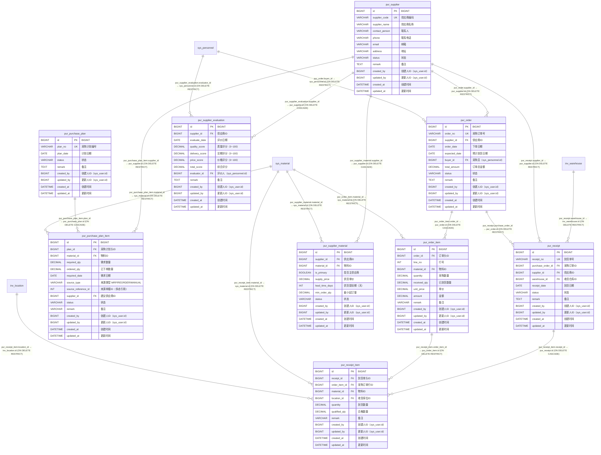

# 采购管理 模块 ER 图（`pur_`）

> 自动内省 `Base.metadata` 生成；本文件只覆盖 `pur_` 前缀的 9 张表。
> 全库关系与跨模块外键见 [`full-er-diagram.md`](./full-er-diagram.md)，
> 字段完整说明见 [`physical-data-model.md`](./physical-data-model.md)。

## 一、本模块表清单

| 表名 | ORM 类 | 说明 | 字段数 |
| --- | --- | --- | --- |
| `pur_order` | `PurOrder` | 采购订单头 | 13 |
| `pur_order_item` | `PurOrderItem` | 采购订单行。`received_qty` 由到货流程回写 | 13 |
| `pur_purchase_plan` | `PurPurchasePlan` | 采购计划头：集中承载待采购需求的建议 | 9 |
| `pur_purchase_plan_item` | `PurPurchasePlanItem` | 采购计划行：来源可以是 MRP 结果或库存补库需求 | 15 |
| `pur_receipt` | `PurReceipt` | 到货登记单头。确认后必须调用 inventory 入库并生成库存流水 | 12 |
| `pur_receipt_item` | `PurReceiptItem` | 到货明细行 | 12 |
| `pur_supplier` | `PurSupplier` | 供应商主数据 | 13 |
| `pur_supplier_evaluation` | `PurSupplierEvaluation` | 供应商评价：质量 / 交期 / 价格 三类评分 | 13 |
| `pur_supplier_material` | `PurSupplierMaterial` | 供应商 N:M 物料 关联表（含供货价与供货提前期） | 12 |

## 二、ER 图（含全部字段）

## 三、外键关系明细

| 子表 | 子列 | 父表 | ON DELETE | 跨模块 |
| --- | --- | --- | --- | --- |
| `pur_order` | `buyer_id` | `sys_personnel` | RESTRICT | 是 |
| `pur_order` | `supplier_id` | `pur_supplier` | RESTRICT | 否 |
| `pur_order_item` | `material_id` | `sys_material` | RESTRICT | 是 |
| `pur_order_item` | `order_id` | `pur_order` | CASCADE | 否 |
| `pur_purchase_plan_item` | `material_id` | `sys_material` | RESTRICT | 是 |
| `pur_purchase_plan_item` | `plan_id` | `pur_purchase_plan` | CASCADE | 否 |
| `pur_purchase_plan_item` | `supplier_id` | `pur_supplier` | RESTRICT | 否 |
| `pur_receipt` | `purchase_order_id` | `pur_order` | RESTRICT | 否 |
| `pur_receipt` | `supplier_id` | `pur_supplier` | RESTRICT | 否 |
| `pur_receipt` | `warehouse_id` | `inv_warehouse` | RESTRICT | 是 |
| `pur_receipt_item` | `location_id` | `inv_location` | RESTRICT | 是 |
| `pur_receipt_item` | `material_id` | `sys_material` | RESTRICT | 是 |
| `pur_receipt_item` | `order_item_id` | `pur_order_item` | RESTRICT | 否 |
| `pur_receipt_item` | `receipt_id` | `pur_receipt` | CASCADE | 否 |
| `pur_supplier_evaluation` | `evaluator_id` | `sys_personnel` | RESTRICT | 是 |
| `pur_supplier_evaluation` | `supplier_id` | `pur_supplier` | CASCADE | 否 |
| `pur_supplier_material` | `material_id` | `sys_material` | RESTRICT | 是 |
| `pur_supplier_material` | `supplier_id` | `pur_supplier` | CASCADE | 否 |
