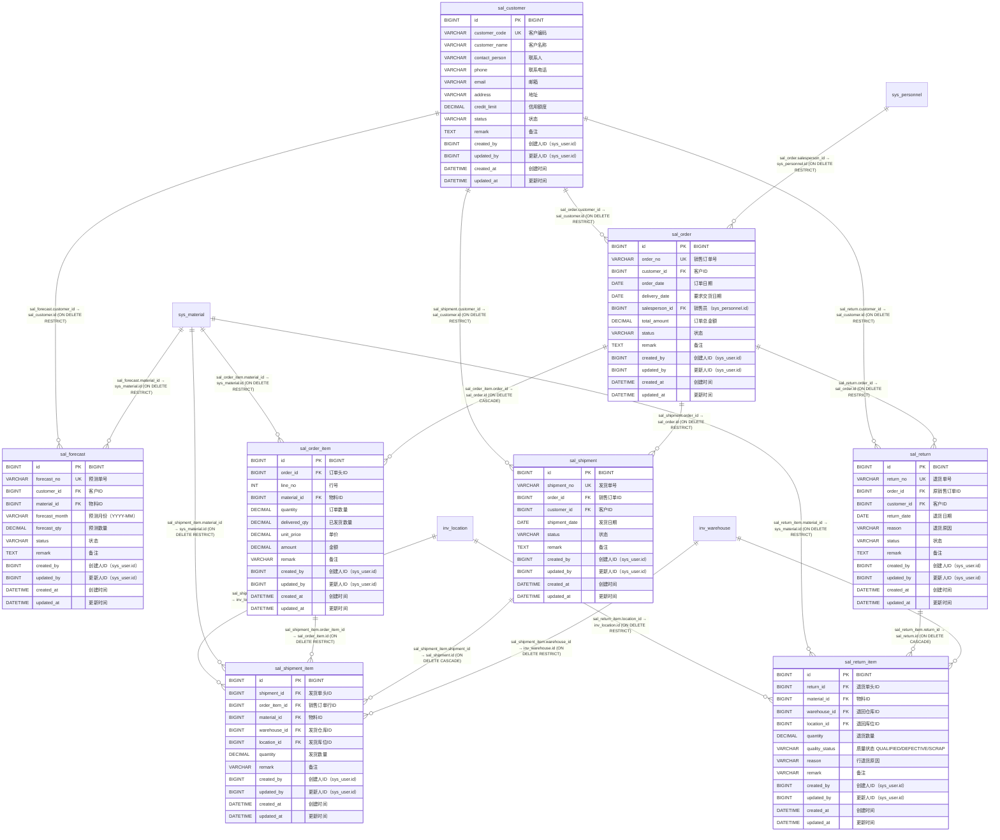

# 销售管理 模块 ER 图（`sal_`）

> 自动内省 `Base.metadata` 生成；本文件只覆盖 `sal_` 前缀的 8 张表。
> 全库关系与跨模块外键见 [`full-er-diagram.md`](./full-er-diagram.md)，
> 字段完整说明见 [`physical-data-model.md`](./physical-data-model.md)。

## 一、本模块表清单

| 表名 | ORM 类 | 说明 | 字段数 |
| --- | --- | --- | --- |
| `sal_customer` | `SalCustomer` | 客户主数据 | 14 |
| `sal_forecast` | `SalForecast` | 销售预测：按月对某物料的预测量，是 Planning 的需求来源之一 | 12 |
| `sal_order` | `SalOrder` | 销售订单头 | 13 |
| `sal_order_item` | `SalOrderItem` | 销售订单行。`delivered_qty` 由发货流程回写 | 13 |
| `sal_return` | `SalReturn` | 销售退货单头。确认退货时调用 inventory 接口入库 | 12 |
| `sal_return_item` | `SalReturnItem` | 退货明细行 | 13 |
| `sal_shipment` | `SalShipment` | 销售发货单头。确认发货时调用 inventory 接口出库 | 11 |
| `sal_shipment_item` | `SalShipmentItem` | 发货明细行 | 12 |

## 二、ER 图（含全部字段）

## 三、外键关系明细

| 子表 | 子列 | 父表 | ON DELETE | 跨模块 |
| --- | --- | --- | --- | --- |
| `sal_forecast` | `customer_id` | `sal_customer` | RESTRICT | 否 |
| `sal_forecast` | `material_id` | `sys_material` | RESTRICT | 是 |
| `sal_order` | `customer_id` | `sal_customer` | RESTRICT | 否 |
| `sal_order` | `salesperson_id` | `sys_personnel` | RESTRICT | 是 |
| `sal_order_item` | `material_id` | `sys_material` | RESTRICT | 是 |
| `sal_order_item` | `order_id` | `sal_order` | CASCADE | 否 |
| `sal_return` | `customer_id` | `sal_customer` | RESTRICT | 否 |
| `sal_return` | `order_id` | `sal_order` | RESTRICT | 否 |
| `sal_return_item` | `location_id` | `inv_location` | RESTRICT | 是 |
| `sal_return_item` | `material_id` | `sys_material` | RESTRICT | 是 |
| `sal_return_item` | `return_id` | `sal_return` | CASCADE | 否 |
| `sal_return_item` | `warehouse_id` | `inv_warehouse` | RESTRICT | 是 |
| `sal_shipment` | `customer_id` | `sal_customer` | RESTRICT | 否 |
| `sal_shipment` | `order_id` | `sal_order` | RESTRICT | 否 |
| `sal_shipment_item` | `location_id` | `inv_location` | RESTRICT | 是 |
| `sal_shipment_item` | `material_id` | `sys_material` | RESTRICT | 是 |
| `sal_shipment_item` | `order_item_id` | `sal_order_item` | RESTRICT | 否 |
| `sal_shipment_item` | `shipment_id` | `sal_shipment` | CASCADE | 否 |
| `sal_shipment_item` | `warehouse_id` | `inv_warehouse` | RESTRICT | 是 |
