# 系统基础数据 模块 ER 图（`sys_`）

> 自动内省 `Base.metadata` 生成；本文件只覆盖 `sys_` 前缀的 15 张表。
> 全库关系与跨模块外键见 [`full-er-diagram.md`](./full-er-diagram.md)，
> 字段完整说明见 [`physical-data-model.md`](./physical-data-model.md)。

## 一、本模块表清单

| 表名 | ORM 类 | 说明 | 字段数 |
| --- | --- | --- | --- |
| `sys_bom` | `SysBom` | BOM 头：某物料在某个版本下的组成关系。`(material_id, bom_version)` 唯一 | 13 |
| `sys_bom_item` | `SysBomItem` | BOM 子项：母件 → 子件，含数量与损耗率（支持多层展开） | 12 |
| `sys_dictionary` | `SysDictionary` | 数据字典（计量单位、物料分类等基础枚举的可维护来源） | 9 |
| `sys_dictionary_item` | `SysDictionaryItem` | 字典项 | 11 |
| `sys_material` | `SysMaterial` | **全系统唯一物料主表** | 17 |
| `sys_operation_log` | `SysOperationLog` | 操作日志：记录关键业务动作，便于审计追踪 | 8 |
| `sys_organization` | `SysOrganization` | 组织 / 部门（树形，`parent_id` 自引用） | 12 |
| `sys_permission` | `SysPermission` | 权限点：菜单 / 页面 / 关键操作（树形） | 13 |
| `sys_personnel` | `SysPersonnel` | 企业员工（全系统唯一人员表） | 14 |
| `sys_role` | `SysRole` | 角色（规格 §30：System Administrator / Sales User / Planner / Buyer / Warehouse User） | 9 |
| `sys_role_permission` | `SysRolePermission` | 角色 N:M 权限 关联表 | 3 |
| `sys_routing` | `SysRouting` | 工艺路线头：某自制件的加工工序集合 | 10 |
| `sys_routing_operation` | `SysRoutingOperation` | 工艺路线工序行 | 13 |
| `sys_user` | `SysUser` | 软件登录账号（与 Personnel 分离：一个 Personnel 可有 0 或 1 个 User） | 12 |
| `sys_user_role` | `SysUserRole` | 用户 N:M 角色 关联表（规格 §21，禁止把多个 ID 塞进 VARCHAR） | 3 |

## 二、ER 图（含全部字段）

```mermaid
erDiagram
    sys_bom {
        BIGINT id PK "BIGINT"
        VARCHAR bom_code "BOM编码"
        BIGINT material_id FK "母件物料ID（sys_material.id）"
        VARCHAR bom_version "BOM版本"
        DATE effective_date "生效日期"
        DATE expiry_date "失效日期"
        BOOLEAN is_active "是否当前激活版本"
        VARCHAR status "状态"
        TEXT remark "备注"
        BIGINT created_by "创建人ID（sys_user.id）"
        BIGINT updated_by "更新人ID（sys_user.id）"
        DATETIME created_at "创建时间"
        DATETIME updated_at "更新时间"
    }
    sys_bom_item {
        BIGINT id PK "BIGINT"
        BIGINT bom_id FK "BOM头ID"
        BIGINT material_id FK "子件物料ID（sys_material.id）"
        DECIMAL quantity "单位用量"
        INT lead_time_offset "提前期偏置（天，相对父件需求时间的提前量）"
        DECIMAL scrap_rate "损耗率（0~1）"
        INT sequence_no "序号"
        VARCHAR remark "备注"
        BIGINT created_by "创建人ID（sys_user.id）"
        BIGINT updated_by "更新人ID（sys_user.id）"
        DATETIME created_at "创建时间"
        DATETIME updated_at "更新时间"
    }
    sys_dictionary {
        BIGINT id PK "BIGINT"
        VARCHAR dict_code UK "字典编码"
        VARCHAR dict_name "字典名称"
        VARCHAR status "状态"
        TEXT remark "备注"
        BIGINT created_by "创建人ID（sys_user.id）"
        BIGINT updated_by "更新人ID（sys_user.id）"
        DATETIME created_at "创建时间"
        DATETIME updated_at "更新时间"
    }
    sys_dictionary_item {
        BIGINT id PK "BIGINT"
        BIGINT dict_id FK "字典ID"
        VARCHAR item_code "字典项编码"
        VARCHAR item_name "字典项名称"
        VARCHAR item_value "字典项值"
        INT sort_no "排序号"
        VARCHAR status "状态"
        BIGINT created_by "创建人ID（sys_user.id）"
        BIGINT updated_by "更新人ID（sys_user.id）"
        DATETIME created_at "创建时间"
        DATETIME updated_at "更新时间"
    }
    sys_material {
        BIGINT id PK "BIGINT"
        VARCHAR material_code UK "物料编码"
        VARCHAR material_name "物料名称"
        VARCHAR material_type "物料类型 RAW/PURCHASED/SEMI/FINISHED"
        VARCHAR supply_type "供应类型 MAKE/BUY"
        VARCHAR unit_code "计量单位"
        VARCHAR specification "规格型号"
        VARCHAR material_group "物料分组"
        INT lead_time_days "提前期（天）"
        DECIMAL safety_stock "安全库存"
        DECIMAL standard_cost "标准成本"
        VARCHAR status "状态"
        TEXT remark "备注"
        BIGINT created_by "创建人ID（sys_user.id）"
        BIGINT updated_by "更新人ID（sys_user.id）"
        DATETIME created_at "创建时间"
        DATETIME updated_at "更新时间"
    }
    sys_operation_log {
        BIGINT id PK "BIGINT"
        VARCHAR module "模块标识"
        VARCHAR action "动作（CREATE/CONFIRM/...）"
        VARCHAR target_type "目标对象类型（表名）"
        BIGINT target_id "目标对象ID"
        BIGINT operator_id "操作人ID（sys_user.id）"
        TEXT detail "详情"
        DATETIME created_at "发生时间"
    }
    sys_organization {
        BIGINT id PK "BIGINT"
        VARCHAR org_code UK "组织编码"
        VARCHAR org_name "组织名称"
        BIGINT parent_id FK "上级组织ID"
        VARCHAR org_type "组织类型"
        BIGINT manager_id "负责人ID（sys_personnel.id，延迟引用避免建表循环）"
        VARCHAR status "状态"
        TEXT remark "备注"
        BIGINT created_by "创建人ID（sys_user.id）"
        BIGINT updated_by "更新人ID（sys_user.id）"
        DATETIME created_at "创建时间"
        DATETIME updated_at "更新时间"
    }
    sys_permission {
        BIGINT id PK "BIGINT"
        VARCHAR perm_code UK "权限编码"
        VARCHAR perm_name "权限名称"
        VARCHAR perm_type "权限类型"
        BIGINT parent_id FK "上级权限ID"
        VARCHAR path "前端路由/接口路径"
        VARCHAR module "所属模块"
        INT sort_no "排序号"
        VARCHAR status "状态"
        BIGINT created_by "创建人ID（sys_user.id）"
        BIGINT updated_by "更新人ID（sys_user.id）"
        DATETIME created_at "创建时间"
        DATETIME updated_at "更新时间"
    }
    sys_personnel {
        BIGINT id PK "BIGINT"
        VARCHAR employee_no UK "员工工号"
        VARCHAR person_name "姓名"
        BIGINT org_id FK "所属组织ID"
        VARCHAR position "岗位"
        VARCHAR phone "联系电话"
        VARCHAR email "邮箱"
        DATE hire_date "入职日期"
        VARCHAR status "状态"
        TEXT remark "备注"
        BIGINT created_by "创建人ID（sys_user.id）"
        BIGINT updated_by "更新人ID（sys_user.id）"
        DATETIME created_at "创建时间"
        DATETIME updated_at "更新时间"
    }
    sys_role {
        BIGINT id PK "BIGINT"
        VARCHAR role_code UK "角色编码"
        VARCHAR role_name "角色名称"
        VARCHAR description "描述"
        VARCHAR status "状态"
        BIGINT created_by "创建人ID（sys_user.id）"
        BIGINT updated_by "更新人ID（sys_user.id）"
        DATETIME created_at "创建时间"
        DATETIME updated_at "更新时间"
    }
    sys_role_permission {
        BIGINT id PK "BIGINT"
        BIGINT role_id FK "角色ID"
        BIGINT permission_id FK "权限ID"
    }
    sys_routing {
        BIGINT id PK "BIGINT"
        VARCHAR routing_code "工艺路线编码"
        BIGINT material_id FK "自制件物料ID（sys_material.id）"
        VARCHAR routing_version "工艺版本"
        VARCHAR status "状态"
        TEXT remark "备注"
        BIGINT created_by "创建人ID（sys_user.id）"
        BIGINT updated_by "更新人ID（sys_user.id）"
        DATETIME created_at "创建时间"
        DATETIME updated_at "更新时间"
    }
    sys_routing_operation {
        BIGINT id PK "BIGINT"
        BIGINT routing_id FK "工艺路线ID"
        INT sequence_no "工序顺序号"
        VARCHAR operation_code "工序编码"
        VARCHAR operation_name "工序名称"
        VARCHAR work_center "工作中心"
        DECIMAL setup_time "准备工时（分钟）"
        DECIMAL run_time "单件加工工时（分钟）"
        VARCHAR remark "备注"
        BIGINT created_by "创建人ID（sys_user.id）"
        BIGINT updated_by "更新人ID（sys_user.id）"
        DATETIME created_at "创建时间"
        DATETIME updated_at "更新时间"
    }
    sys_user {
        BIGINT id PK "BIGINT"
        VARCHAR username UK "登录名"
        VARCHAR password_hash "密码哈希"
        VARCHAR display_name "显示名"
        BIGINT personnel_id UK,FK "关联员工ID（1:1，可为空）"
        VARCHAR status "状态"
        DATETIME last_login_at "最近登录时间"
        TEXT remark "备注"
        BIGINT created_by "创建人ID（sys_user.id）"
        BIGINT updated_by "更新人ID（sys_user.id）"
        DATETIME created_at "创建时间"
        DATETIME updated_at "更新时间"
    }
    sys_user_role {
        BIGINT id PK "BIGINT"
        BIGINT user_id FK "用户ID"
        BIGINT role_id FK "角色ID"
    }
    sys_material ||--o{ sys_bom : "sys_bom.material_id → sys_material.id (ON DELETE RESTRICT)"
    sys_bom ||--o{ sys_bom_item : "sys_bom_item.bom_id → sys_bom.id (ON DELETE CASCADE)"
    sys_material ||--o{ sys_bom_item : "sys_bom_item.material_id → sys_material.id (ON DELETE RESTRICT)"
    sys_dictionary ||--o{ sys_dictionary_item : "sys_dictionary_item.dict_id → sys_dictionary.id (ON DELETE CASCADE)"
    sys_organization ||--o{ sys_organization : "sys_organization.parent_id → sys_organization.id (ON DELETE RESTRICT)"
    sys_permission ||--o{ sys_permission : "sys_permission.parent_id → sys_permission.id (ON DELETE RESTRICT)"
    sys_organization ||--o{ sys_personnel : "sys_personnel.org_id → sys_organization.id (ON DELETE RESTRICT)"
    sys_permission ||--o{ sys_role_permission : "sys_role_permission.permission_id → sys_permission.id (ON DELETE CASCADE)"
    sys_role ||--o{ sys_role_permission : "sys_role_permission.role_id → sys_role.id (ON DELETE CASCADE)"
    sys_material ||--o{ sys_routing : "sys_routing.material_id → sys_material.id (ON DELETE RESTRICT)"
    sys_routing ||--o{ sys_routing_operation : "sys_routing_operation.routing_id → sys_routing.id (ON DELETE CASCADE)"
    sys_personnel ||--|| sys_user : "sys_user.personnel_id → sys_personnel.id (ON DELETE RESTRICT)"
    sys_role ||--o{ sys_user_role : "sys_user_role.role_id → sys_role.id (ON DELETE CASCADE)"
    sys_user ||--o{ sys_user_role : "sys_user_role.user_id → sys_user.id (ON DELETE CASCADE)"
```

## 三、外键关系明细

| 子表 | 子列 | 父表 | ON DELETE | 跨模块 |
| --- | --- | --- | --- | --- |
| `sys_bom` | `material_id` | `sys_material` | RESTRICT | 否 |
| `sys_bom_item` | `bom_id` | `sys_bom` | CASCADE | 否 |
| `sys_bom_item` | `material_id` | `sys_material` | RESTRICT | 否 |
| `sys_dictionary_item` | `dict_id` | `sys_dictionary` | CASCADE | 否 |
| `sys_organization` | `parent_id` | `sys_organization` | RESTRICT | 否 |
| `sys_permission` | `parent_id` | `sys_permission` | RESTRICT | 否 |
| `sys_personnel` | `org_id` | `sys_organization` | RESTRICT | 否 |
| `sys_role_permission` | `permission_id` | `sys_permission` | CASCADE | 否 |
| `sys_role_permission` | `role_id` | `sys_role` | CASCADE | 否 |
| `sys_routing` | `material_id` | `sys_material` | RESTRICT | 否 |
| `sys_routing_operation` | `routing_id` | `sys_routing` | CASCADE | 否 |
| `sys_user` | `personnel_id` | `sys_personnel` | RESTRICT | 否 |
| `sys_user_role` | `role_id` | `sys_role` | CASCADE | 否 |
| `sys_user_role` | `user_id` | `sys_user` | CASCADE | 否 |
